# Relational model $\begin{array}{c} \text{Carlos rivero} \\ \text{Rochester institute of technology} \\ \text{Dept. Of computer science} \end{array}$

These slides present the relational model unit in which we are to learn how to devise relational databases.

### Roadmap

- **1. History**
- 2. Conceptual model
- 3. Logical model
- 4. From conceptual to logical
- 5. Physical model
- 6. Miscellaneous
- 7. Conclusions

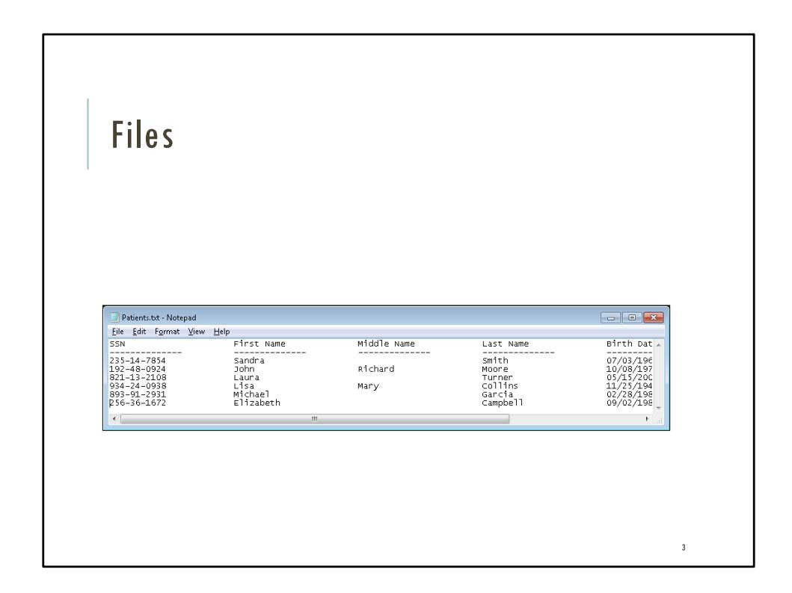

The history of data management is the history of relational databases. During late 1960s, computers started to be quite popular among companies because they were a costeffective option to manage the data they needed to store and process. At this time, companies used files to manage their data needs, for instance, here you can see an example of a file that contains data of some patients being treated in a hospital.

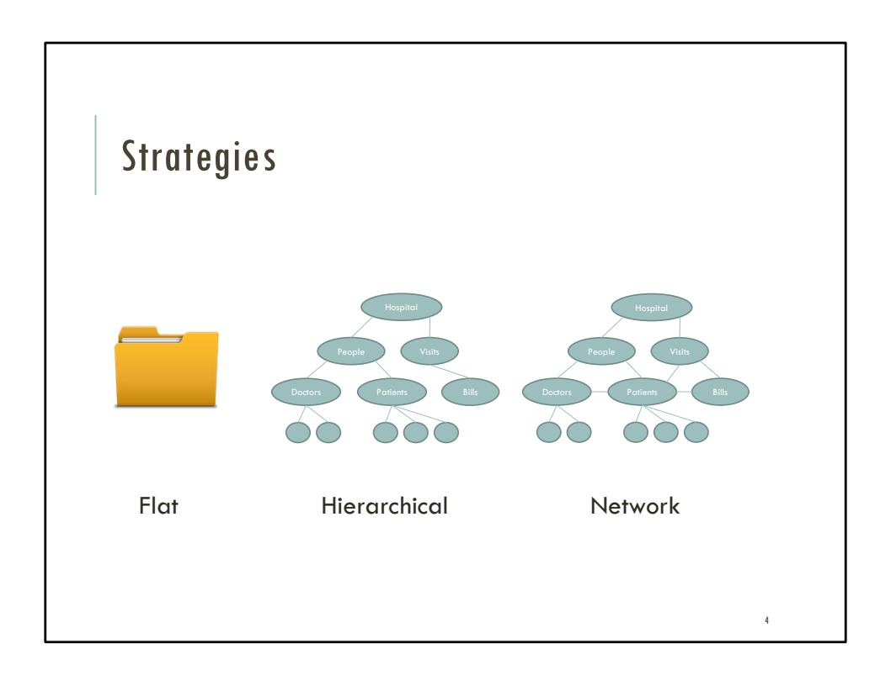

There were different strategies to manage these files. The easiest one was the flat files, in which all of the files were stored at the same level or folder. The hierarchical strategy was designed to store files in a tree structure so it was possible to navigate until finding the right type of files. The network strategy was similar to the previous one but using a general graph instead of a tree.


When these systems evolved, it was usually necessary to make changes in the content of a given file, e.g., we wish to switch the first and last name columns. All programs that read that file needed to be changed to take the new situation into account. Another problem was that, to access some data, it was mandatory to navigate through the file system to find that data, e.g., if I want to access a specific bill I need to navigate from different nodes. A final drawback is that, if there is a change in the file structure, we need to change all programs that perform navigations, e.g., bills are accessed from patients.

### Edgar F. Codd (1923 – 2003)

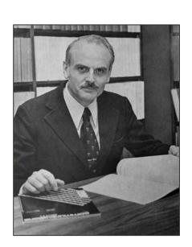

- E. F. Codd. A Relational Model of Data for Large Shared Data Banks. Commun. ACM 13(6): 377-387 (1970).
- IBM Almaden
- Turing Award, 1981

Edgar Codd devised the relational model to solve the problems with data stored in the file system. He proposed the model in 1970 in a paper called: "A Relational Model of Data for Large Shared Data Banks". He was working at IBM Almaden at that time. He received the Turing Award in 1981.

|             |             | The relational model |  |             |  |        |           |
|-------------|-------------|----------------------|--|-------------|--|--------|-----------|
| Patient     |             |                      |  |             |  |        |           |
| SSN         |             | First Name           |  | Middle Name |  |        | Last Name |
| 235-14-7854 |             | Sandra               |  |             |  |        | Smith     |
| 192-48-0924 |             | John                 |  | Richard     |  | Moore  |           |
| 821-13-2108 |             | Laura                |  |             |  |        | Turner    |
|             | Visit       |                      |  |             |  |        |           |
|             | SSN         |                      |  | Scheduled   |  | Weight |           |
|             | 235-14-7854 |                      |  | 09/03/2014  |  | 141.5  |           |
|             |             | 821-13-2108          |  | 10/18/2014  |  | 167.8  |           |
|             |             |                      |  |             |  |        |           |

A relational model consists of "tables" called relations, each of which comprises fixedlength tuples. Each relation is used for a different type of entity. We define keys over relations, which allow us to uniquely identify a tuple in a relation. By using keys, we are able to refer to different tuples. For instance, in this example, we define relations Patient and Visit with different attributes like the social security number (SSN) or first, middle and last names. We use the SSN as the key for a patient since it uniquely identifies a person. Using that key, we are able to refer to each patient in the Visit relation, e.g., Sandra Smith attended a visit that was scheduled for 09/03/2014 and her weight was 141.5 pounds.


The relational model was a revolutionary idea but, do you think it was successful?


His paper was initially rejected!

### What did the reviewer say?

- "... at first sight I doubt that anything complex enough to be of practical interest can be modeled using relations."
- "... any realistic model might end up requiring dozens of interconnected tables hardly a practical solution given that, probably, we can represent the same model using two or three properly formatted files."
- "The paper can be safely rejected."

10

The reviewer said the following about Codd's paper: "... at first sight I doubt that anything complex enough to be of practical interest can be modeled using relations.", "... any realistic model might end up requiring dozens of interconnected tables —hardly a practical solution given that, probably, we can represent the same model using two or three properly formatted files.", and "The paper can be safely rejected." As we will see, these comments were not very proper.

### However…

- "… no real-world example (…) any model of practical interest can be cast in it."
- "… no experiments (…) how it compares with traditional ones on real-world problems."
- "… to extract any significant answer from any real database, the user will end up with the very inefficient solution of doing a large number of joins."

However, we must also say that some of the comments were accurate. The paper presented no real-world example and no evaluation. Additionally, he did not present any implementation since it was impractical at the moment due to a general lack of sufficient computing power. Finally, the reviewer pointed out one of the main drawbacks of relational databases: for complex queries, we need to perform a (possibly large) number of joins.


We will study joins in this course but, just to let you know, we join two relations by one or more attributes and get a single relation as a result. In this case, we take relations Patient and Visit and join them using the SSN, resulting in the Patient-Visit relation. Check that John Richard Moore did not attended any visit so he is excluded from the final relation.


The relational model was rejected at the beginning but it became quite popular. A solid proof of this is the large number of commercial relational databases that exist nowadays, for instance, Oracle, MySQL, MS SQL Server, PostgreSQL, IBM DB2 or MS Access, just to mention a few examples. You can check for more relational databases online.


A coupe of years ago, some of the new big players like Facebook or Google stated that relational databases do not fit their needs due to the large amount of joins that they needed to perform. Do you remember the reviewer that criticized Codd's paper? NoSQL databases aim to avoid the relational model due to this problem. Not only that, they also claim that relational databases focus on structure data and there is a need for storing semistructured data like documents.

### Roadmap

- 1. History
- **2. Conceptual model**
- 3. Logical model
- 4. From conceptual to logical
- 5. Physical model
- 6. Miscellaneous
- 7. Conclusions

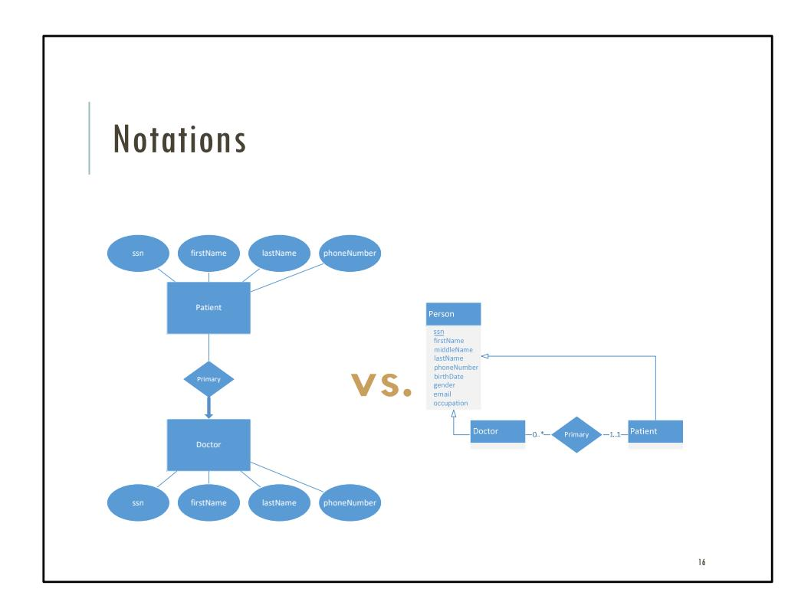

A note about the notations. You need to know that they are different ways of representing the same concepts. As you can see, the diagram in the left has attributes represented as bubbles while, in the other, they are group as part of the Person entity set. The diagram in the left does not allow specializations. The diagram in the left uses arrows while the diagram in the right uses explicit cardinalities. We will focus on the notation of the diagram in the right.


An entity is a "thing" or "object" in the real world that you can distinguish from other entities, e.g., a doctor working for a hospital. An entity may be a physical object, such as a person or a book, or it may be non-physical, such as a visit, a course offering, or a flight reservation. An entity has a set of descriptive properties or attributes. An entity set is a set of entities of the same type that share the same attributes, for instance, all doctors of a hospital form the Doctor entity set. We represent an entity set as a rectangle divided into two parts in which we put the name of the entity set in the first part.

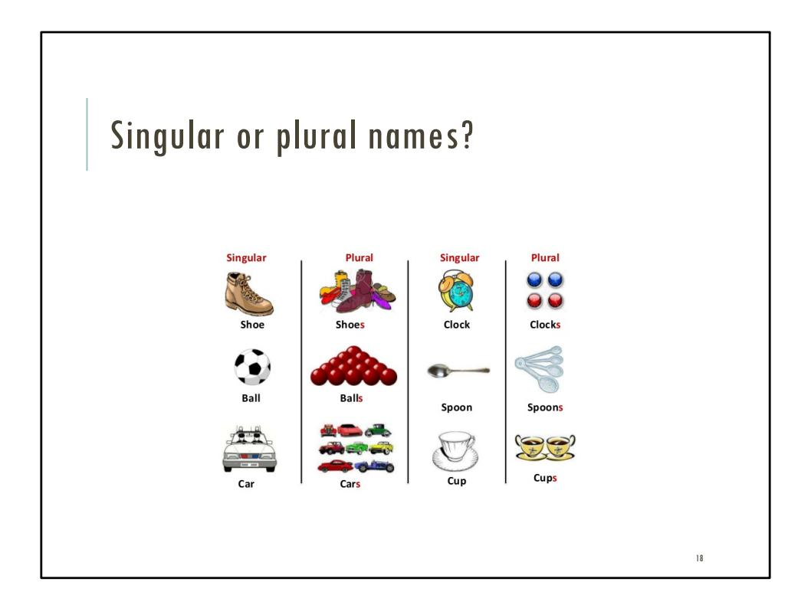

Let's take a moment to discuss about the names of our entity sets. You may probably have seen that there are people that tend to use singular names for concepts and others use plurals. I am not going to force you to use one or the other, the only thing that I will force you is to be consistent: if you use singular names, please, ALWAYS use singular names. In my slides I use singular, but feel free to use plurals if you think they fit more. Object-Oriented programming recommends to use singular names.


When we assign an attribute to an entity set it means that the database stores similar information concerning each entity in the entity set, however, each entity may have its own value for each attribute. We represent attributes by their names in the second part of the entity set rectangle. Some sample attributes of a Patient may be her/his name, date of birth, or gender. Each entity has a value for each of its attributes. In this case, Jacob Jones is a male whose date of birth is 08/01/2003.


Note that there legal and privacy issues related to some of these attributes. Certain health information is protected in the US and other countries, such as name, address, birth date, Social Security Number (https://www.hhs.gov/hipaa/for-professionals/privacy/specialtopics/de-identification/index.html). What about birth and death year of celebrities? Check this out: https://en.wikipedia.org/wiki/Hoang\_v.\_Amazon.com,\_Inc. Check also the code of conduct of the data scientist: http://www.code-of-ethics.org/code-of-conduct/


A relationship is an association among several entities, e.g., a patient has a primary doctor. A relationship set is a set of relationships of the same type, in which two or more entity sets are involved. The function that an entity plays in a relationship is called that entity's role. We represent a relationship set as a diamond and the involving entity sets connected by lines, we will see later the cardinalities.


A warning: the name of the relationship sets must be meaningful. They cannot be repeated and it needs to give a good idea on what you are modeling.


Relationship sets usually involve just two entity sets, however, in some cases we may need to define non-binary relationship sets that involve more than two entity sets. For instance, in a clinical trial, some doctors and patients are involved, and each of the doctors is responsible for some of the patients (not all of them). The ER model allows you to define these non-binary relationship sets, however, in my opinion, they are complex to understand for the average database developer, so we will try to avoid them.


Relationship sets may also comprise descriptive attributes, e.g., we can specify the policy number of a patient in a given insurance company. We represent it by connecting a rectangle with the name of the attribute by using a dashed line.

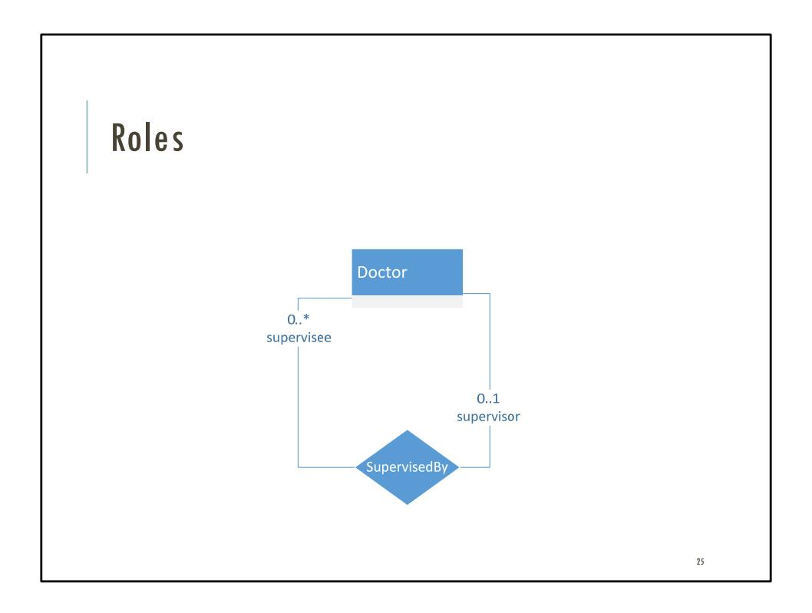

Since entity sets participating in a relationship set are generally distinct, roles are implicit and are not usually specified. However, they are useful when the meaning of a relationship set needs clarification. Such is the case when the entity sets of a relationship set are not distinct; that is, the same entity set participates in a relationship set more than once in different roles. In this example, the Supervised by relationship set involves twice the Doctor entity set, the supervisor and the supervisees.

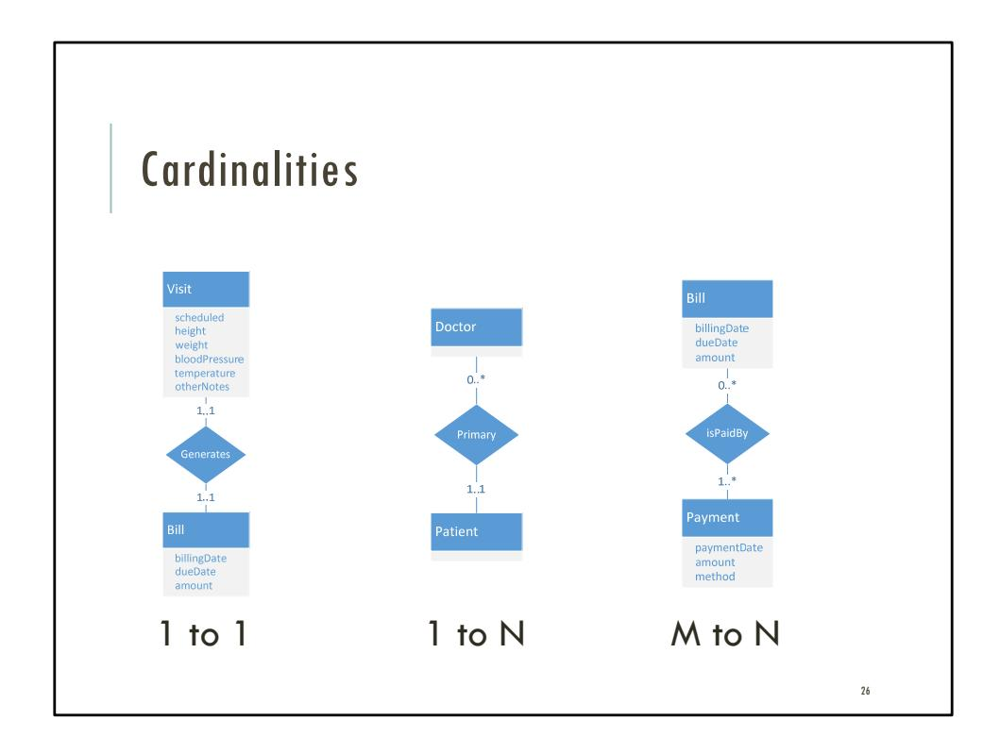

Cardinalities represent the number of entities that may be involved in a relationship. We have three different types: 1 to 1, 1 to many and Many to many. In the first type, it is just possible to relate two entities in each side, for instance, each visit generates one single bill. We represent them by using 1. Note that we may also enforce they must be mandatory, that is, there may not exist a visit without a generated bill and the other way around. The second type entails that one single entity may be related to one or more of the other entities, for example, a doctor may be the primary doctor of several patients. Finally, the third type entails that multiple entities may be related to other multiple entities, for example, a bill can be paid by one or more payments and a payment can pay several bills.

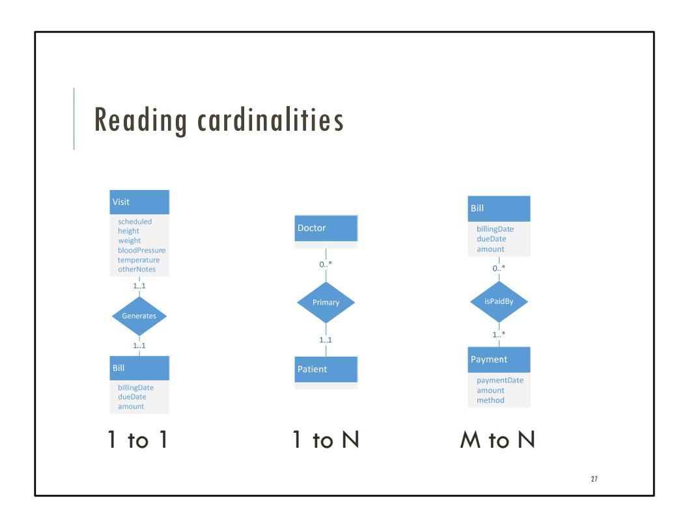

Reading cardinalities is a bit confusing. You need to focus on the relationship set and think how many entities of the entity set may appear in such relation. For instance, in the Primary relationship set, a patient will only appear once but the same doctor may appear multiple times since she/he may be the primary doctor of many patients.

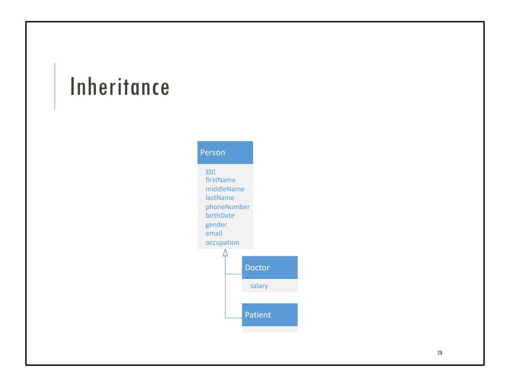

We will also work with inheritance. In this case, we allow an entity set to be specialized in multiple entity sets that share some common attributes. In this case, doctors and patients have the same attributes but they are involved in different relationship sets. We represent it as a triangle connecting the entity sets. Person is the "root" and Doctor and Patient are the "children".

| Identity: keys and how to select them |  |    |
|---------------------------------------|--|----|
|                                       |  |    |
|                                       |  |    |
|                                       |  | 29 |

We need to uniquely identify an entity in a given entity set using only the attributes we have identified. In other words, no two entities that belong to the same entity set are allowed to have exactly the same value for these attributes, if this happens, both entities are the same. The set of attributes that uniquely identify an entity in an entity set is called a key. Be careful when selecting a key. A bad example of a key is using the name of a person, it is very likely that we will have two doctors or patients with the same name, so we should avoid that. Using the SSN is a good solution since in the US this number is expected to be unique, no two people share the same number. As a rule of thumb, try to use those attributes whose values never change or rarely change, for instance, the address is another example of a bad key, it is very likely that a person will not have the same address during her/his whole life.

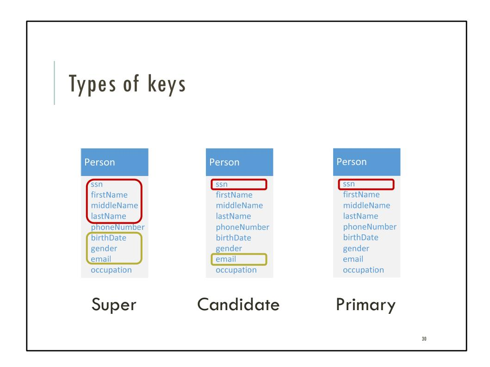

There are different types of keys. A super key is a collection of one or more attributes whose values together uniquely identify an entity. In our example, a super key is formed by the ssn, first, middle and last names of a person; additionally, we can also use the birth date, gender and email to identify people. A candidate key is similar to a super key but using only those attributes whose subsets do not form a super key, that is, they are minimal. In our example, ssn and email are two candidate keys. Finally, ssn is a primary key, that is, the final key that we are going to use to identify a person.

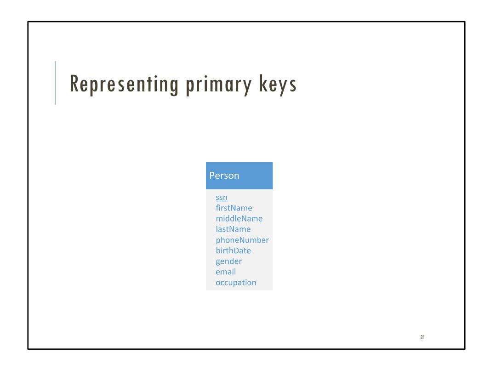

We will underline the attributes that form the primary key, in this example, ssn.

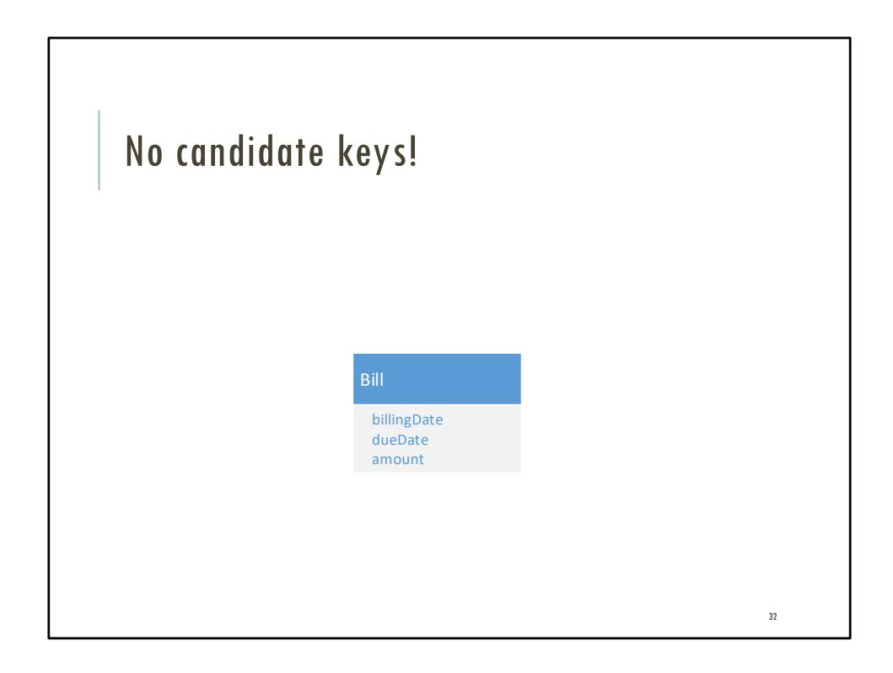

Now the question is, what happens if we do not have any candidate keys in our entity sets? Check that, for instance, we cannot refer to a bill by its billing date, due date and amount, there will be probably be two bills with these same attributes that are not the same bill. What can we do then?

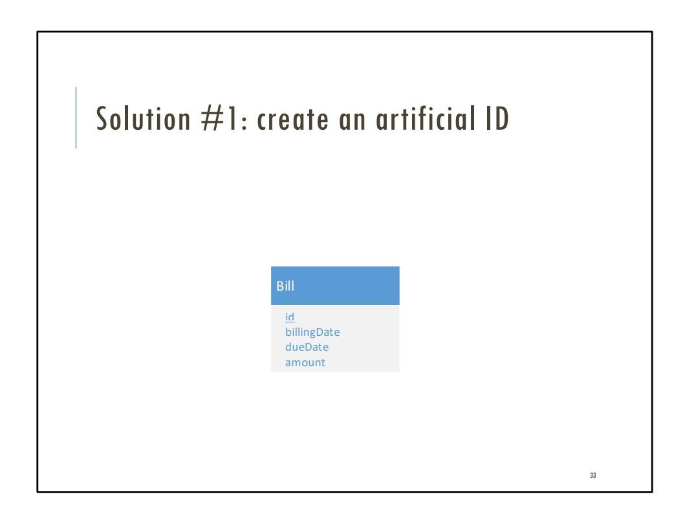

The first solution is to assign an id attribute to the entity set. In this sense, we need to ensure that this id is unique by using an id authority. In our example, we create an id for bills. Note that bills are usually extremely important for business (it is the way money is collected!), so you have probably seen that a bill has a unique id to identify it.


The second option is to use the so-called weak entity sets. In this case, instead of creating an artificial id, we use another entity set plus a relationship set between them to define a key. For instance, entity set Visit has several attributes but none of them can be used as candidate keys. The single attribute that is useful is the date the visit is scheduled, but as you can imagine that is not enough to identify each visit. To identify them, we can think of using Patient since only one patient can have a visit scheduled for the same date and time. In this case, we use Attends as the identifying relationship set. To represent them, we use a double line diamond for the relationship set and we identify the key of the weak entity set using a dashed line.

A note on the cardinalities. You can only use weak entity sets following this same pattern, that is, the identifying relationship set is many-to-one from the weak entity set to the identifying entity set, and the participation of the weak entity set is total, that is, always "1..1". The identifying relationship set should not have any descriptive attributes, since any such attributes can instead be associated with the weak entity set.

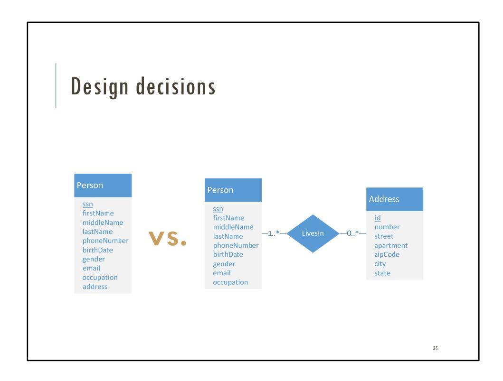

During the creation of these models, you will need to make some design decisions that may have an impact in the future. For instance, whether or not to create an artificial id or use a weak entity set. Another example: assume that you decide to store the address where a person lives as an attribute consisting of a large chunk of text, for instance, 1 Lomb Memorial Dr, Rochester, NY 14623. Everything is working properly until a couple of months later you need to retrieve patients that live in Pittsford, NY. A good design for that will be the other one presented in this slide. At the end of these slides, we will discuss a bit more about these design decisions.

### Roadmap

- 1. History
- 2. Conceptual model
- **3. Logical model**
- 4. From conceptual to logical
- 5. Physical model
- 6. Miscellaneous
- 7. Conclusions

36


Our logical model will be implemented using the relational model.

| Relations |    |            |
|-----------|----|------------|
|           |    | Patient    |
|           | PK | ssn        |
|           |    | firstName  |
|           |    | middleName |
|           |    | lastName   |
|           |    |            |
|           |    |            |

We define relations, each of which has a unique name and a number of attributes. In this example, we define the patient relation that has three attributes: ssn, firstName, middleName and lastName. Check that we specify that ssn is the primary key by using PK.

| firstName<br>middleName<br>lastName<br>Sandra<br>null<br>Smith<br>943-23-9874<br>John<br>Richard<br>Moore<br>862-74-3611 | ssn         |  |               |
|--------------------------------------------------------------------------------------------------------------------------|-------------|--|---------------|
|                                                                                                                          |             |  | primaryDoctor |
|                                                                                                                          | 235-14-7854 |  |               |
|                                                                                                                          | 192-48-0924 |  |               |
|                                                                                                                          |             |  |               |

We are able to represent data using the relations as you can see in this example. Each row is called a tuple that consists of an entity of the relation, that is, a single patient or doctor. Check also that we have some special values that are the null values, which entail that the value is missing or is not known.


We are also able to define foreign keys, which allow us to connect other relations. In this case, we are including the SSN of a doctor in the patient relation to model that a given doctor is the primary doctor of a patient. We represent them by using FK and connecting using an arrow. Please, notice the direction of the arrow.


In this example, we use the SSNs of the doctors to identify them as primary doctors of the patients using foreign keys.

### Referential integrity

- Foreign keys are used to maintain referential integrity, i.e., values that appear in one relation for a set of attributes also appear for another set of attributes in another relation.
- Every time we update the database, referential integrity will be checked!

### Structured Query Language (SQL)


- Data definition language
- CREATE, DROP, ALTER
- Data manipulation language
- INSERT, UPDATE, DELETE, SELECT
- Aka CRUD

SQL is a programming language designed for managing data in a relational database. It is divided into the data definition and data manipulation languages. The main feature of SQL is that it is declarative, that is, we define what we want to do and no how to do it, the interpreter is the program responsible for that. For the DDL, we have CREATE, DROP and ALTER queries. For the DML, we have INSERT, UPDATE, DELETE and SELECT queries. The latter are also called CRUD operations, which stands for Create, Retrieve, Update and Delete.

## Create and selecting a database

CREATE DATABASE hospMng;

USE hospMng;

. . .

44

```
CREATE
CREATE TABLE Patient (
   ssn CHARACTER(9),
   firstName VARCHAR(75) NOT NULL,
   middleName VARCHAR(75),
   lastName VARCHAR(75) NOT NULL,
   primaryDoctor CHARACTER(9),
   PRIMARY KEY (ssn),
   FOREIGN KEY (primaryDoctor) REFERENCES Doctor(ssn) 
);
```

Here you have an example on how to create the Patient relation. Note that relations are also called tables, this is the reason for the "CREATE TABLE". We also specify the attributes, aka columns, each of which has a type and we can also add a "NOT NULL" constraint, which entails that null values are not allowed for these attributes. Finally, we can specify that ssn is the primary key of the relation and has a foreign key from primary to the primary key of the Doctor relation.

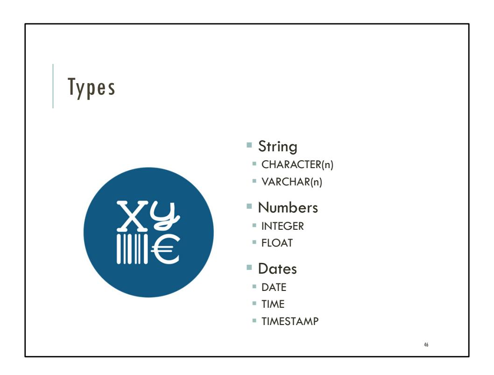

There are several data types that we can use for attributes. Here you have some examples that we are going to use during the course. For strings, we are able to use CHARACTER, a string with a fixed size of n characters, or VARCHAR, a string with a variable size of n characters. For numbers, INTEGER and FLOAT. And for dates, DATE is used for a specific day (09/15/2015), TIME for a specific time (1:45:19) and TIMESTAMP for both date and time (09/15/2015 – 1:45:19).

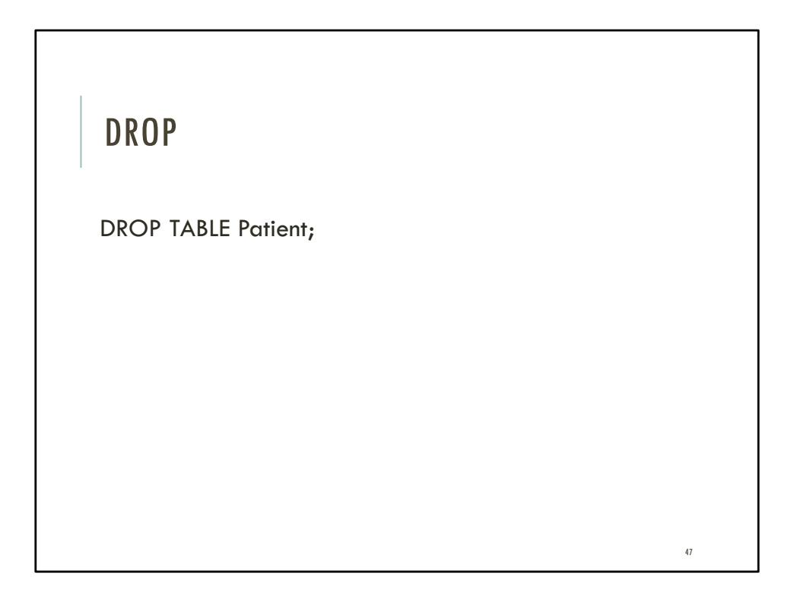

We can use DROP TABLE to remove a relation from our database.

### ALTER

ALTER TABLE Patient DROP COLUMN middleName; ALTER TABLE Patient ADD middleName VARCHAR(50);

48

We use ALTER TABLE to change the specification of a relation. We can remove an attribute using DROP COLUMN or we can add a new attribute using ADD.

### INSERT

```
INSERT INTO 
   Patient (ssn, firstName, lastName)
VALUES
   ('235147854', 'Sandra', 'Smith');
```

49

The INSERT INTO query is used to create new tuples in a given relation. In this case, we are adding a new patient. Check that it is important to specify the names of the attributes, which will be used to refer to the values, that is, the first value corresponds to ssn, the second to firstName, and the third to lastName.

### UPDATE

```
UPDATE Patient
   SET firstName = 'Sarah', lastName = 'Morrison'
WHERE
   ssn = '235147854';
```

50

We can update a set of tuples in a relation using UPDATE. We define the values that we wish to update and a filtering condition using WHERE. For example, for the tuple with ssn equal to 235147854, we change the firstName and lastName to Sarah and Morrison, respectively.

### DELETE

DELETE FROM Patient WHERE firstName = 'Sandra';

We can remove tuples from a relation using a DELETE query. In this case, we specify the table and a condition over the tuples we wish to remove, for instance, we wish to remove those tuples whose firstName is Sandra.


We will see SELECT queries, which are read-only queries, in the next unit. We will also study how to use select queries to add, update and delete tuples.

### Roadmap

- 1. History
- 2. Conceptual model
- 3. Logical model
- **4. From conceptual to logical**
- 5. Physical model
- 6. Miscellaneous
- 7. Conclusions

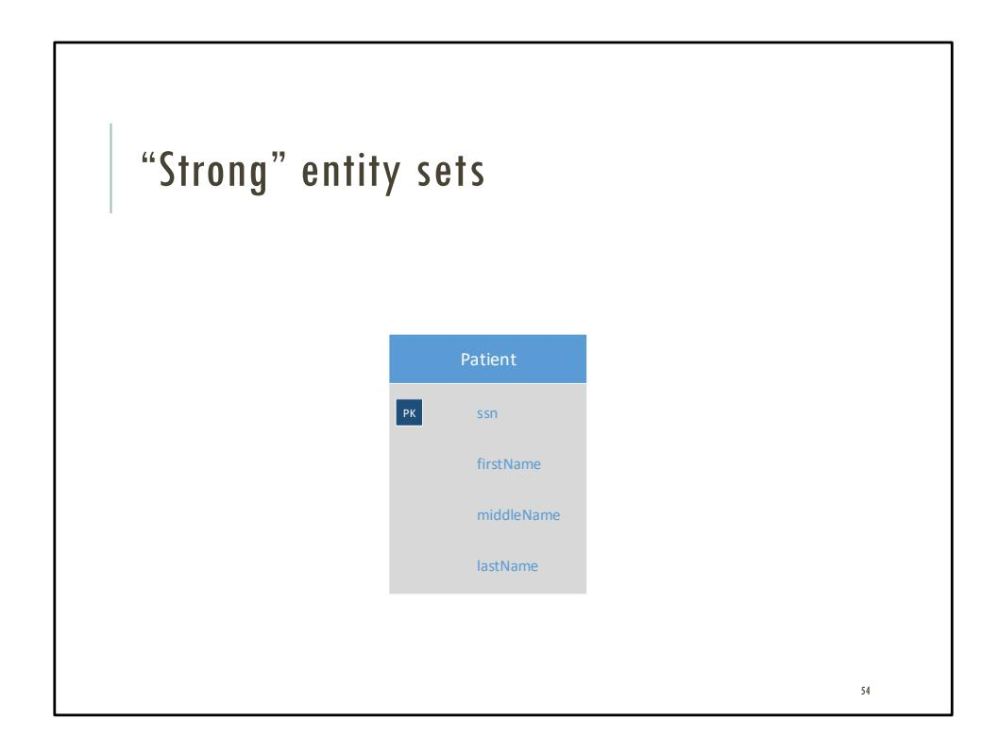

Take each "strong" entity set and transform it into a relation and use the primary keys that we have identified. We call an entity set "strong" in contrast with weak entity sets. See here the Patient relation.

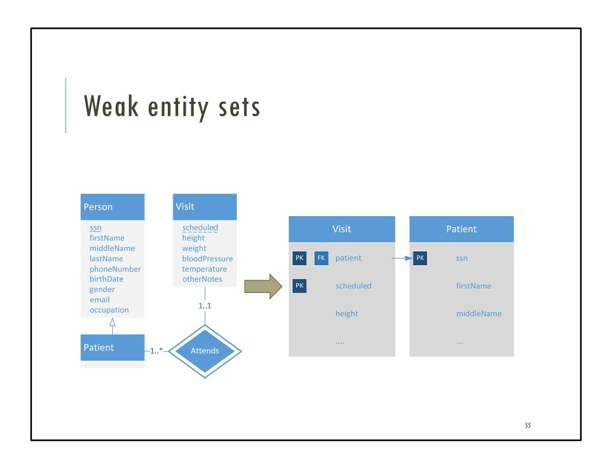

When we have a weak entity set, we transform it into a relation in which we add the primary keys of the "strong" entity set. Then, we add a foreign key to the primary key of that "strong" entity set. In this case, we create a Visit relation with a new attribute patient that is a foreign key to Patient. Both attributes patient and scheduled form the primary key of Visit.

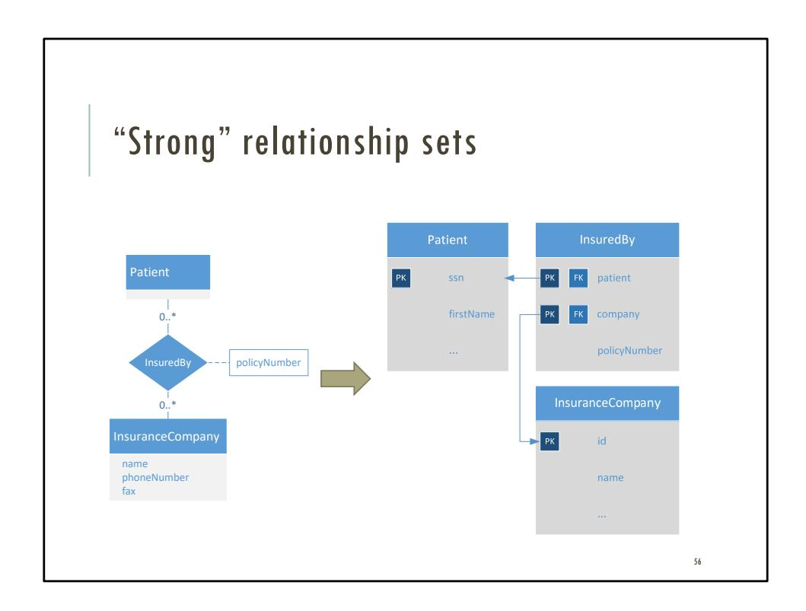

The general rule is to create a new relation for every relationship set. As you can see here, you add the primary keys of both entity sets to the new relation, do not forget the foreign keys, and also add the relationship set attributes if it is has them.


There are some exceptions to the general rule to make our relational database more efficient by avoiding redundant relations. In this case, instead of creating a Primary relationship set, we add it as an attribute to the Patient relation and its corresponding foreign key. Careful! This only works for one-to-one and one-to-many relationship sets. Be more careful! Check that every patient always has a primary doctor but, if that were not the case, we would need to create patients with a null value in the primaryDoctor attribute. You need to check if this is the behavior that you wish and, if it is not the case, using the general rule of creating one relation by itself.

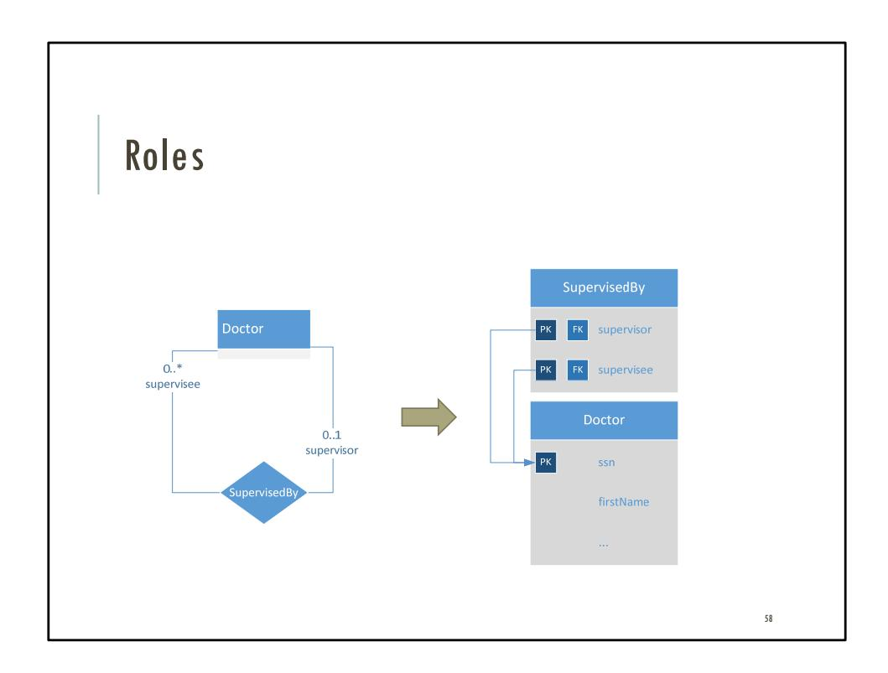

Roles are used to name attributes on the resulting relation from the relationship set. In this case, we use supervisor and supervisee as the names of the attributes of the SupervisedBy relation.


We discard weak relationship sets since they are usually redundant, we have already considered them when transforming the weak entity sets they are related to.


As for inheritance, there are three different strategies to transform them into relations in a relational database.


The first strategy maps the whole hierarchy into relations, that is, for each entity set we will have a relation in our database. Check that we introduce foreign keys for all those relations that are not the top one, such as Patient or Doctor in this example. Check also that the attributes that are specific of a given entity set only appear in them.

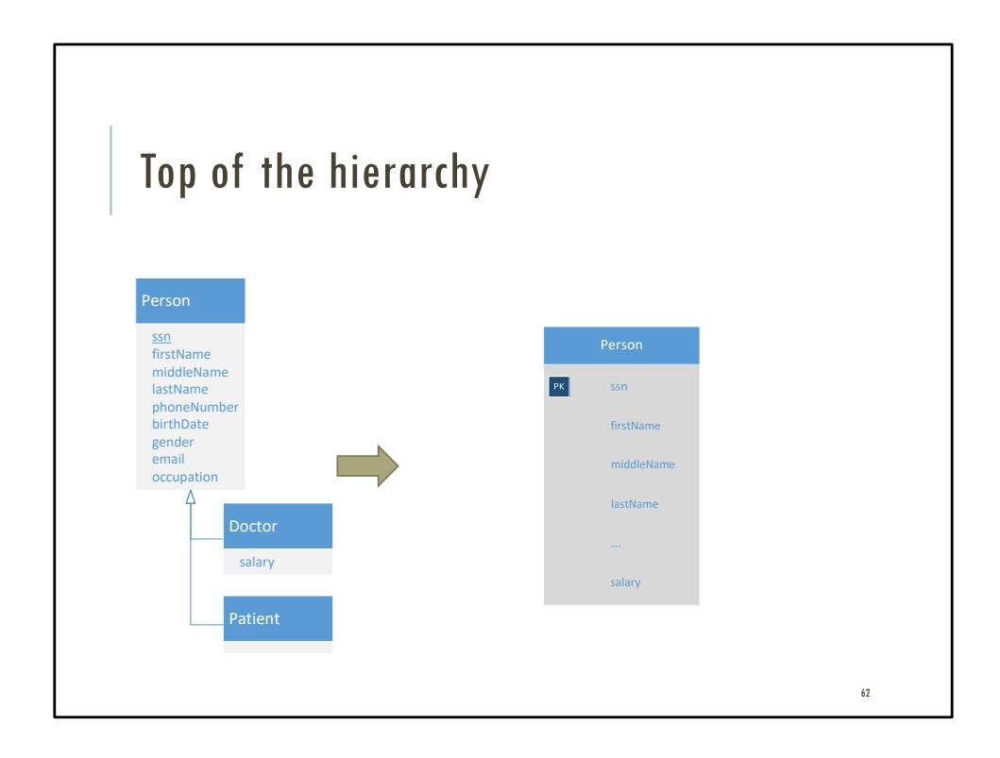

We only create one single relation that has all of the attributes of all entity sets combined. If we are creating a new patient, the resulting tuple will have salary equal to null. You need to check if that is the desired behavior or not.


The final strategy consists of creating relations just for the bottom entity sets, having all common attributes in the relation. In this case, we repeat all attributes except salary for both relations.

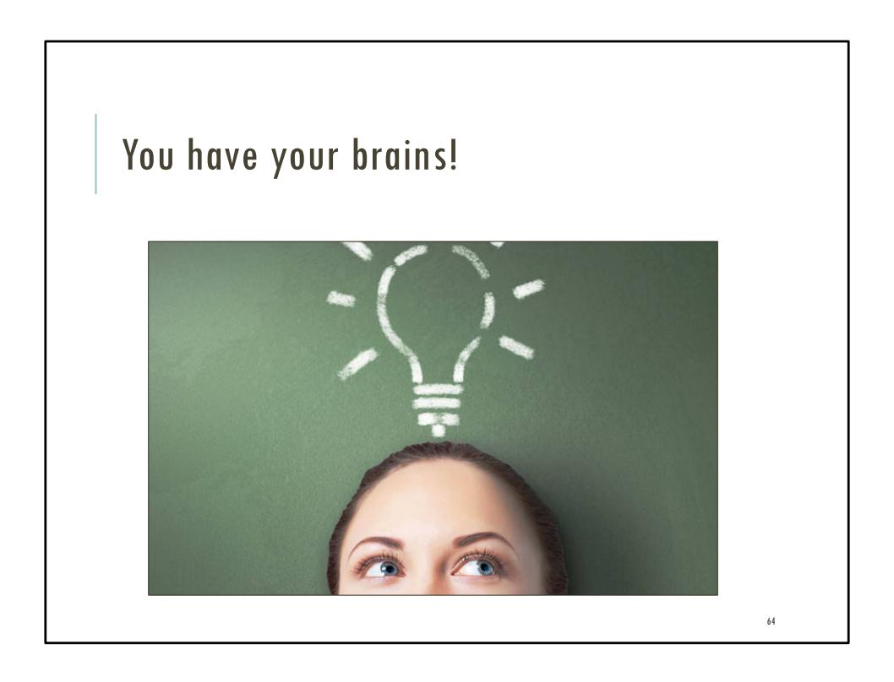

The final rule is: you have your brains! Apply the previous rules using your intelligence. If you see that the resulting relations are not going to work or you feel that something weird is going to happen, try to overcome the problem by thinking of a good solution, do not blindly stick to the rules! If this process were completely automatic, we would not study it. The reason because it is not automatic is that you need to use your brains during the whole process.

Design decisions

During the creation of logical models you will need to make more design decisions that may have an impact in the future. For instance, using the whole strategy will give us a completely different logical model than using the top strategy.

### Roadmap

- 1. History
- 2. Conceptual model
- 3. Logical model
- 4. From conceptual to logical
- **5. Physical model**
- 6. Miscellaneous
- 7. Conclusions

66

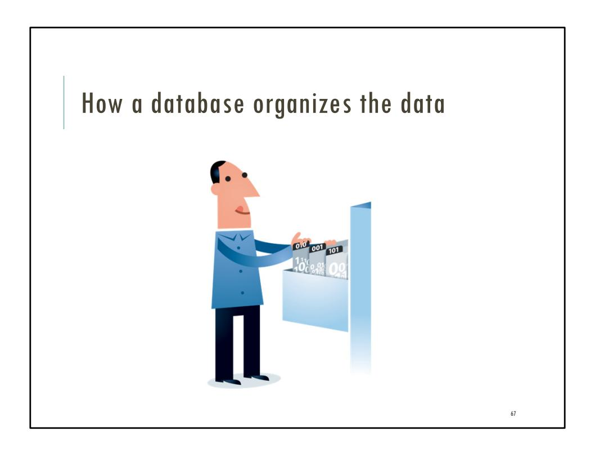

The physical model contains how a database organizes the data.

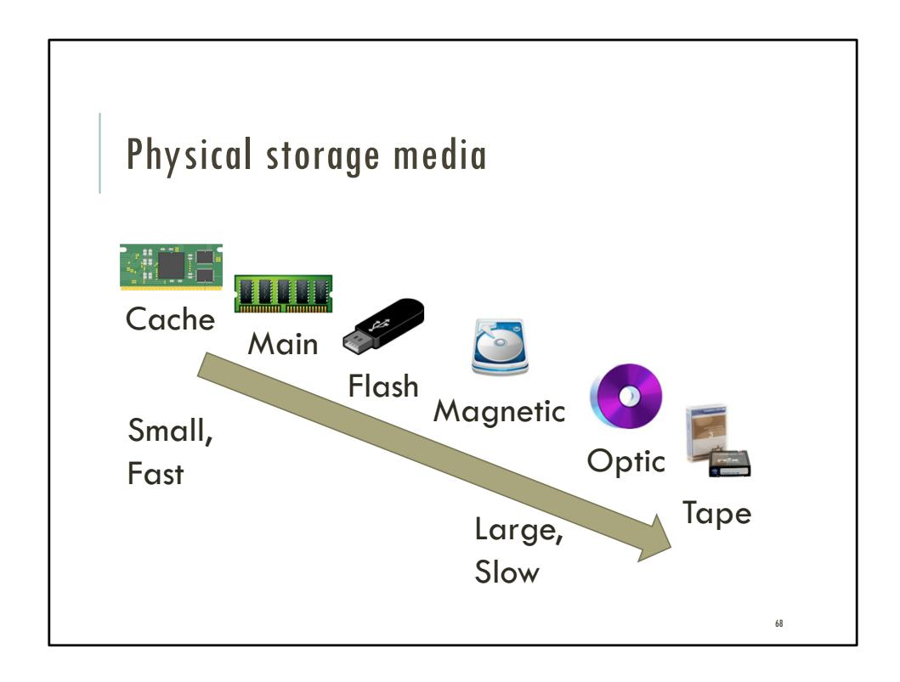

You can see here how physical storage media is organized from small and fast to large and slow access. Cache memory is managed by the computer system hardware. Generalpurpose machine instructions operate in main memory. Flash memory differs from main memory that stored data are retained even if power is turned off (or fails). Magnetic disks usually store the whole database. In optic disks data is read by a laser. Finally, tape storage is used primarily for backup and archival data.

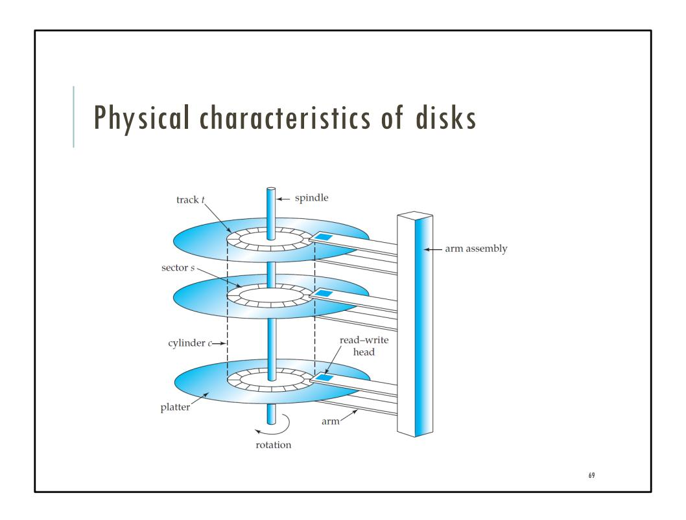

Disks are organized as follows: there are some platters each of which has a flat, circular shape. Its two surfaces are covered with a magnetic material, and information is recorded on the surfaces. When the disk is in use, a drive motor spins it at a constant high speed. There is a read–write head positioned just above the surface of the platter. The disk surface is logically divided into tracks, which are subdivided into sectors. A sector is the smallest unit of information that can be read from or written to the disk.


A disk I/O request specifies the address on the disk to be referenced; that address is in the form of a block number. A block is a logical unit consisting of a fixed number of contiguous sectors. Data are transferred between disk and main memory in units of blocks.

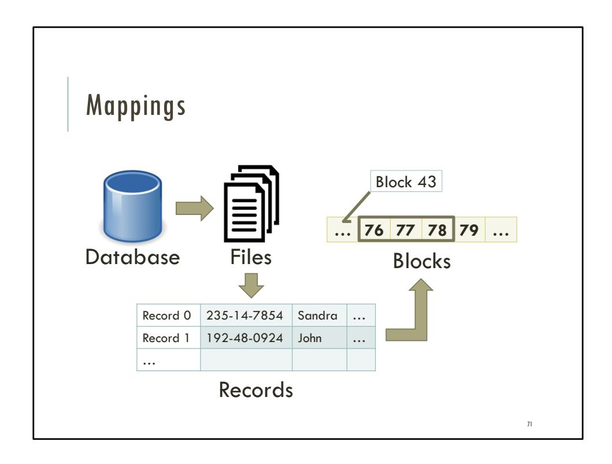

A database is mapped into a number of different files that are maintained by the underlying operating system. These files reside permanently on disks. A file is organized logically as a sequence of records. These records are mapped onto disk blocks.

### Roadmap

- 1. History
- 2. Conceptual model
- 3. Logical model
- 4. From conceptual to logical
- 5. Physical model
- **6. Miscellaneous**
- 7. Conclusions

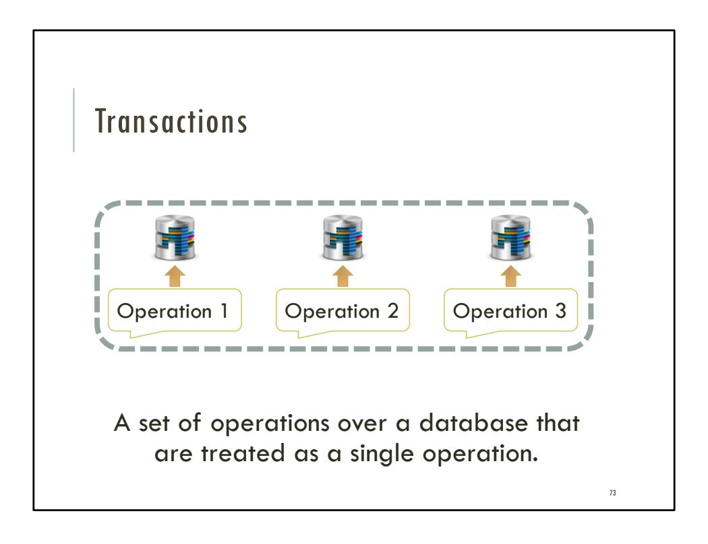

A transaction is a set of operations over a database that are treated as a single operation.

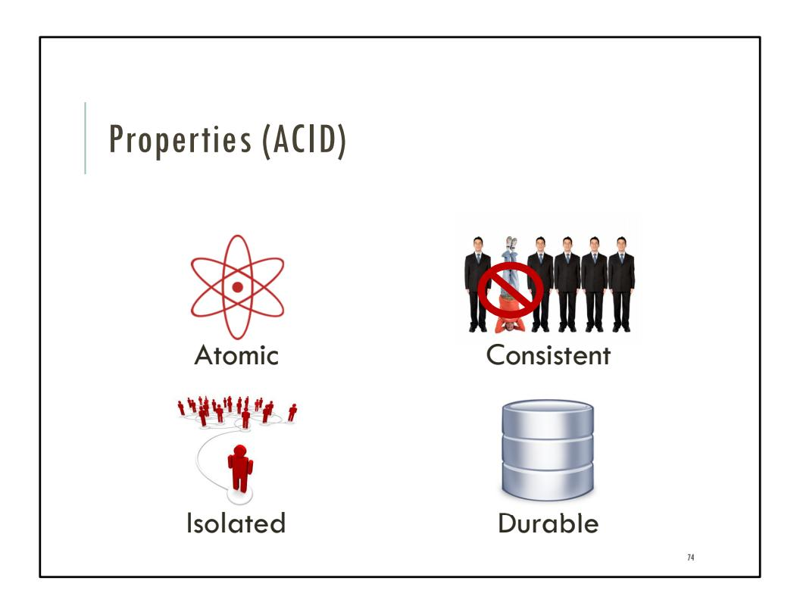

The properties of a transaction are as follows:

Atomic: every operation in the group must succeed, if not, all of them must be undone (rollback).

Consistent: if the data was consistent before the transaction, it must be consistent after it. Isolated: the effects of a transaction that is in progress are hidden from other transactions. Durable: the results of a complete transaction are persistent.


To transform a conceptual model into a logical model in MySQL, you need to do the following.

```
Using SQL
CREATE TABLE Patient (
   ssn CHARACTER(9),
   firstName VARCHAR(75) NOT NULL,
   middleName VARCHAR(75),
   lastName VARCHAR(75) NOT NULL,
   primaryDoctor CHARACTER(9),
   PRIMARY KEY (ssn),
   FOREIGN KEY (primaryDoctor) REFERENCES Doctor(ssn) 
);
                                                        76
```

Create a new database, connect to the database and use SQL to generate the relations (tables).


To insert data programmatically in the new database using MySQL, you need to do the following.

User management in MySQL

CREATE USER 'USERNAME'@'localhost' IDENTIFIED BY 'PASSWORD';

USE hospMng;

GRANT ALL ON hospMng.\* TO 'USERNAME'@'localhost';


78

You must have a database user to connect to it. You need also to give the user privileges to work with the database. Note that you create a user that can be use multiple databases, so you need to grant access to that specific user. WARNING: You should not use this last statement in real-world settings, grant all privileges to a user can be dangerous. This is out of scope of this course.

### Programmatic access to MySQL (1)

```
Connection con = null;
PreparedStatement st = null;
ResultSet rs = null;
String url = "jdbc:mysql://localhost:3306/hospMng";
String user = "USERNAME";
String pwd = "PASSWORD";
```

To have programmatic access to MySQL you must refer to the MySQL/J JDBC connector. You should have a code similar to the one presented in the slide to have such access. WARNING: It is not a good idea to have the database password embedded in your code. To avoid this, there are several solutions depending on the technology that you are using. This is out of scope of this course.

79

### Programmatic access to MySQL (2)

```
try {
  con = DriverManager.getConnection(url, user, pwd);
  st = con.prepareStatement("SELECT ssn FROM Patient");
  rs = st.executeQuery();
  if (rs.hasNext())
      System.out.println(rs.getString("ssn"));
}
```

…

### Programmatic access to MySQL (3)

```
catch (SQLException oops) {
  System.out.println("Something went really wrong.");
} finally {
  try {
    if (rs != null) rs.close();
    if (st != null) st.close();
    if (con != null) con.close();
  catch (SQLException oops) {
    System.out.println("Something went really wrong.");
  }
}
```

…

```
Transactions (1)
try {
  con.setAutoCommit(false);
  st = con.prepareStatement("INSERT INTO " + 
       "Payment(id, paymentDate, amount, method) " +
       "VALUES (?,?,?,?)"); 
  st.setInt(1, 743);
  st.setString(2, '09/02/16');
  st.setInt(3, 536);
  st.setString(4, "Check");
  st.executeUpdate();
  st.close();
```

There are times when you do not want one statement to take effect unless another one completes, for instance, you want to include a payment and which bill is actually paying at the same time. A transaction is a set of one or more statements that is executed as a unit, so either all of the statements are executed, or none of the statements is executed. By default, all statements in JDBC have auto commit set to true, so we need to change that behavior by setting it to false.

```
Transactions (2)
  st = con.prepareStatement("INSERT INTO IsPaidBy(bill, payment) VALUES (?,?)");
  st.setInt(1, 123);
  st.setInt(2, 743)
  st.executeUpdate();
  st.close();
  con.commit();
} catch (SQLException oops) {
  …
  con.rollback();
  …
```

We then execute the insert statements and, if everything goes smoothly, we perform a commit, that is, both inserts will be saved in the database. If not, we perform a rollback to leave the database as it was before the transaction.

### Batch processing (1)

```
String url = "jdbc:mysql://localhost:3306/hospMng? 
rewriteBatchedStatements=true";
con.setAutoCommit(false);
(…) // Create PreparedStatement st
```

For batch processing, i.e., inserting large amounts of data, you need to add rewriteBatchStatements to the JDBC connection URL and use batch processing. Check the following post for additional info: https://www.journaldev.com/2494/jdbc-batch-insertupdate-mysql-oracle.

### Batch processing (2)

```
for (int cnt =0; (…) ; cnt++) {
  (…) // Insert parameters in st
  st.addBatch();
  if (cnt % STEP == 0) {
     st.executeBatch(); // Run the statements so far
     con.commit(); // Commit the changes
st.executeBatch(); // Run the final statements
con.commit(); // Commit the changes
```

85

### Roadmap

- 1. History
- 2. Conceptual model
- 3. Logical model
- 4. From conceptual to logical
- 5. Physical model
- 6. Miscellaneous
- **7. Conclusions**

### Modeling tips

- Avoid redundancy as much as you can
- Never use arrays or anything of the sort: all data should be "plain"
- Your queries should easily fit (next unit!)

## Thanks! crr@cs.rit.edu corrected Rochester institute of technology Dept. Of COMPUTER SCIENCE Rochester institute of technology Dept. Of COMPUTER SCIENCE

Thank you very much for your attention.