### Data querying

## Retrieving data efficiently
Data querying consists of retrieving data from a database. We usually have a large amount of data that we wish to filter out to perform another task.

# Introduction
> This is the roadmap that we are going to follow for these slides. First, we are going to introduce SELECT queries in SQL. Then, we will study how to perform aggregate and string operations in SQL, and how to perform joins, set operations and how to nest SQL queries. We will study how SQL queries are executed by the database query engine and how to have programmatic access to the database. Finally, we will summarize our main conclusions. Let's start with introducing SQL.

# Structured Query Language (SQL) 

- Data definition language 
	- CREATE, DROP, ALTER 
- Data manipulation language 
	- INSERT, SELECT, UPDATE, DELETE,  
	- Aka CRUD
> Do you remember this slide? We have already seen some basic SQL queries. We said that we were going to study SELECT later and that moment has arrived.

## Declarative Language

> The main feature of SQL is that it is a declarative language. This means that you always specify what you want to do but never how to do it. Check that it is not the same asking for patients that live in Pittsford, NY than "1. Go to the Patient folder; 2. Open the file index; 3. For each file; 3.1. If city = 'Pittsford'; 3.1.1. Store patient in result; 4. Return result". This entails that SQL is easy to use to retrieve data but it also means that we need to be extremely careful knowing how it works to keep a good performance of our queries. We will work on this during these slides.

## Logical model
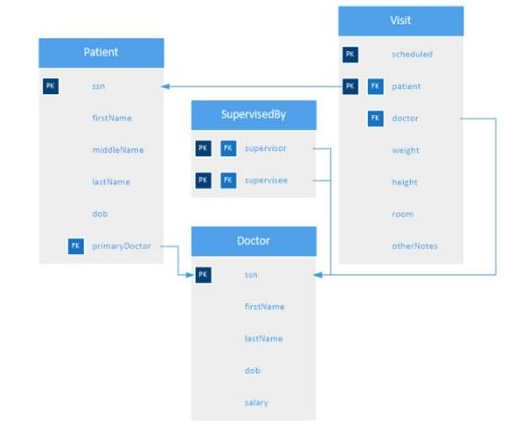

## Simple query
```sql
SELECT firstName
FROM Patient;
```

> The most simple SELECT query is this one, in which we are retrieving the first names of the patients. See how we specify attributes to be retrieved and relations from which we wish to extract the data. In this case, we retrieve a result which consists of another relation named "Result", which is a fake name, that has one single attribute: the first names of the patients.

## Closure property
```sql
SELECT a,b
FROM A;
SELECT b
FROM "Result";
```
> One of the main properties of SQL is the closure property: the result of a SQL query is a new relation that can be further used in another SQL query.

## Simple query
```sql
SELECT lastName
FROM Doctor;
```
> Another simple SELECT query is this one, in which we are retrieving the last names of the doctors. See that we retrieve repeated results, how do we avoid this?

## Removing redundant
```sql
SELECT DISTINCT lastName
FROM Doctor;
```
> We can remove redundant tuples using DISTINCT. Warning: please, make sure that you cannot avoid using DISTINCT since it is computational expensive.

## Warnings
We are going to see several warnings in these slides. They are thought to warn you about performance issues like the previous one. As we have seen, SQL is a powerful query language and its main feature is that it is declarative, but that also means we do not know how it exactly works internally, so we need to keep that in mind when devising our queries. That entails that we need to have some rough ideas on how relational databases implement these queries. You have already learned how to use DISTINCT, please, avoid using DISTINCT in all of your queries blindly since it is computationally expensive, only use it if you have no other choice.

## Arithmetic Operations
```sql
SELECT
	lastName, salary * 1.1
FROM Doctor;
```
> We can also perform some arithmetic operations over the resulting attributes. For instance, in this case, we are retrieving the salary times 1.1. Other allowed operators are +, −, and /, and we can use constants or other attributes in the query. Check that the name of the attribute is "salary \* 1.1", what do we do to avoid that?

## Attribute renaming
```sql
SELECT
	lastName, salary * 1.1 AS projected
FROM Doctor;
```
> We can rename names of attributes using the AS clause. In this case, check that the name in the final relation is projected.
## Star
```sql
SELECT *
FROM Doctor;
```
> If we do not know the names of the attributes of a specific relation, we are able to use \* to refer to all of them.

## Conditions
```sql
SELECT ssn, firstName
FROM Doctor WHERE (salary < $130k AND lastName = 'Patel') OR salary > $170K;
```
> We can also specify conditions to retrieve just some specific tuples. We use the WHERE clause in which we can express Boolean conditions using AND, OR and NOT, and we can also use different comparison operators like <, <=, >, >=, =, and <>. In this case, we are retrieving just those doctors whose salary is less than \$130K and last name is Patel, or doctors whose salary is greater than \$170K.

## Null Values
```sql
SELECT ssn
FROM Patient
WHERE middleName IS NOT NULL;
```
>Remember that we may have some empty values for some attributes in tuples, how do we deal with that? The answer is using IS NULL or IS NOT NULL, as in this example, in which we are interested in retrieving patients whose middle name is not null.

```sql
SELECT ssn, lastName FROM Doctor
ORDER BY lastName ASC, salary DESC;
```
> We are able to sort the tuples in our results by using the ORDER BY clause. We are able to use one or more attributes for the sorting and we are able so specify if we wish ascending (ASC) or descending (DESC) order. In this example, we wish to retrieve the doctors sorted by their last names ascending, and salaries descending. Check that we can mention salary in the sorting even if we are not returning it in the result. Warning: do you actually need to sort your results? If not, try to avoid this clause, it would have a heavy impact on the performance.

INSERT, UPDATE, DELETE
```sql
INSERT INTO …
SELECT …;

DELETE FROM …
WHERE …;

UPDATE … SET …
WHERE …;
```
> Remember these types of queries? You can use all of the constructs that we have already seen in these slides. You can also add data to a relation using a SELECT query. You can also specify which tuples you want to delete or update using conditions.

# Aggregation and string operations
We are going to study how to perform aggregations and string operations.

## Aggregation functions
SQL has 5 built-in aggregation functions: avg, min, max, sum and count, which stand for average, minimum, maximum, total and count, respectively.

## Basic aggregation queries
```sql
SELECT MIN(salary)
FROM Doctor WHERE
dob >= '1986-01-01';
```
> In the basic aggregations, we are looking for a specific, single value like the minimum salary of doctors 30 years old or younger. Note that, in this case, it only retrieves one single value, this is the usual behavior of aggregation queries. The question is, how can we compute multiple aggregations?

```sql
SELECT lastName, AVG(salary)
FROM Doctror
WHERE salary < $170k
GROUP BY lastName;
```
> The answer is using the GROUP BY clause. The attribute or attributes given in the clause are used to form groups. Tuples with the same value on all attributes in the clause are placed in one group. In the example you can see how to perform an aggregation. Note that we have excluded Rachel Wang from the final result, what do we need to do if we wish to filter tuples by the aggregation?

## Having
```sql
SELECT lastName, AVG(salary)
FROM Doctor
GROUP BY lastName
HAVING AVG(salary) > $140K
```
> The answer is using the HAVING clause. We may express conditions over the groups created by the GROUP BY clause using it. In the example, we are retrieving the average salary of the doctors by last name but only when the average salary is greater than \$140K.

## String operations

> We use the LIKE clause to compare strings using pattern matching. We can say, for example, that we are interested in those values that start with 'Smit', or those that contain 'oor'. Additionally, we are also able to specify that we are interested in strings of 3 characters, or strings with at least three characters. Be careful when using string comparisons! They may have a really bad performance.

## No indexes!
```sql
SELECT ssn
FROM Doctor
WHERE lastName LIKE 'Smit%';
```
>If we do not create any index on lastName, the performance of this query will be slow since we need to iterate through each doctor checking that her/his last name starts with Smit.
## Indexes 
A data structure that facilitates efficient queries over attributes in a relation.

The previous physical model is automatically managed by our database, however, we are able to fine-tune certain structures to improve performance. An index is one of these structures that facilitates efficient queries over attributes in a relation. It is similar to having an index of contents in a book to have direct access to some specific content.

## Indexes for primary keys
By default, every primary key will be automatically indexed so there is no need to create any index for them.

## Index everything!
Indexes are entirely up to database administrators in relational databases. That means that they need to make a decision on what and when create indexes. The solution of creating indexes for all relations and columns is not reasonable: indexes speed up queries but updates are quite slow, they also take space in disk. As a result, you need to think carefully when creating indexes.

## B+-tree
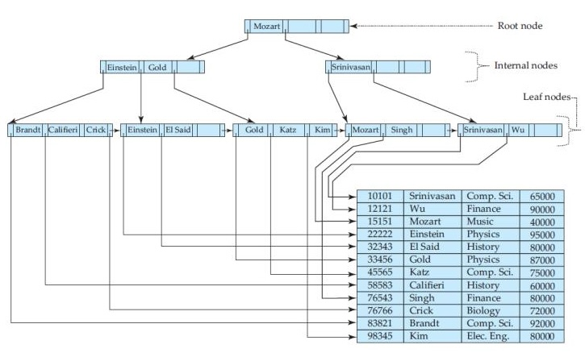
> Indexes can be implemented in many different ways and each implementation has its benefits and drawbacks. One implementation is a B+-tree that consists of a tree structure in which each node has a sorted list of the attribute values we are interested in. When we perform a query, we follow the pointers until finding the row that we were looking for. Note that, in this case, we are using an example taken from the textbook in which we are storing the last names of instructors and their departments.

## Hashing
Another implementation is based on hashing, in which we select a bucket according to the hashing of an instructor's department. There are several solutions to deal with overflow of buckets or their allocation.

## Indexes in MySQL
```sql
CREATE INDEX PersonBirthDate ON Person(birthDate) '[USING {BTREE | HASH}]';
```
> To create an index in MySQL this is the syntax you will use. In this case, it is likely that we will access plenty of times the birth date of our patients. It is also possible to specify which index implementation we wish to use, BTREE by default.
### B+-tree index Rules

- =, >, <, >=, <= and BETWEEN are allowed.
- <> is **NOT** allowed.
- LIKE queries of the form 'ZZZ%' and 'ZZ%ZZ%' are also allowed.
- LIKE queries of the form '%ZZZ%' are NOT allowed.
- Queries of the form "lastName LIKE firstName" are NOT allowed (the second value is not a constant).

## Hash Index Rules
- =, <> are allowed.
- The rest is **NOT** allowed.

## Not only strings

> Note that we are studying indexes in the context of string operations, but they can be also applied to other types of attributes like dates, integers or binaries.

## Fulltext indexes
The previous indexes work when you want to retrieve a value as a whole. However, when working with strings, we wish to have more options like a substring contained in the value. Fulltext indexes help us with these operations.

## Inverted index 

| Word  | List                                                |
| ----- | --------------------------------------------------- |
| fever | (192-48-0924, 09/02/16), (997-32-4058, 10/15/15), … |
| cold  | (192-48-0924, 09/02/16), (471-87-0982, 01/01/14), … |
| pain  | (471-87-0982, 01/01/14), … neck …                   |
| …     | …                                                   |
> Inverted index uses a list in which each word is related to the unique identifier of an entity. For instance, if we wish to query the otherNotes attribute of the visits, we would have a list like the one you can see in the slide. Note that Visit is identified by the SSN of a patient and the scheduled date, so that is the reason why the index includes both.

## N-grams
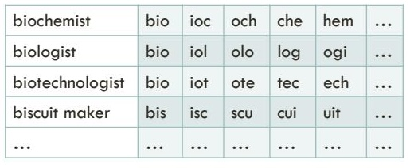
>N-grams divide a string value into sequences of n values. For instance, assume that we wish to index the occupation of every patient to perform queries like "patients that work in bio". 3-grams are very popular and you can see in the slide an example of them.

## Fulltext indexes in MySQL

```sql
CREATE FULLTEXT INDEX VisitOtherNotes ON Visit(otherNotes);
```
This is the statement you need to use to create a fulltext index in MySQL. Note that MySQL uses inverted index to implement the fulltext indexes.

## Regular vs. Fulltext indexes
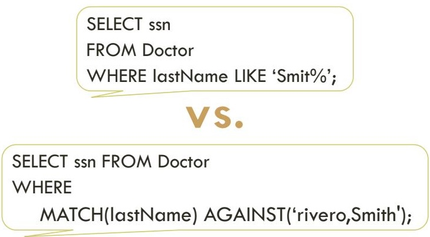
>The main difference between regular and fulltext indexes is that regular indexes are automatically managed by the engine while fulltext indexes need to be explicitly invoked.

## Natural language mode

> Fulltext indexes have two modes in MySQL. First mode is natural language that looks for case insensitive keywords.

## Boolean mode

> The Boolean mode allows to match include and exclude substrings. We can also use wildcards but always with some fixed characters at the beginning, that is, '+\*ZZZ' or '-\*ZZZ' are never allowed.
# Join, set and nested queries
Let's study now how to perform join, set and nested queries.

## Cartesian Product and renaming
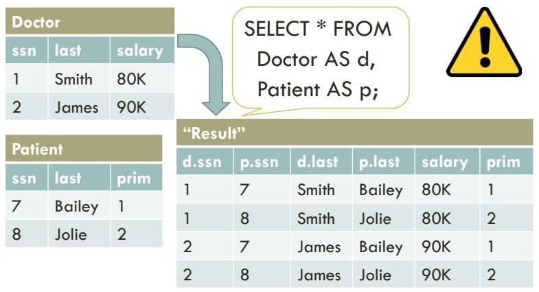
> Assume that we are interested in retrieving each patient with her/his primary doctor. If we perform the query that you see in this slide, we will retrieve a Cartesian product between the Doctor and Patient relations and the result, as you can see, entail that all doctors are the primary doctors of all patients, which does not make sense. Note that we are renaming the relations using AS. Warning: performing Cartesian products, as you can imagine, has a very bad performance, how can we avoid them?

## "Handmade" joins
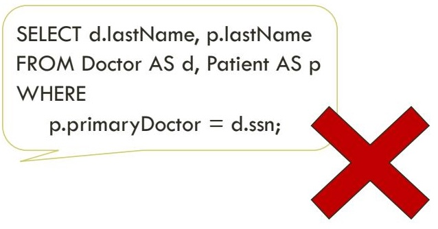
> We modify the previous query to perform a "handmade" join, in which we specify the attributes that we wish to compare. In our example, we perform a Cartesian product between Doctor and Patient relations, and filter out those whose primaryDoctor attribute in Patient is different from the ssn of the doctor. The result of this query is the last names of each patient and her/his primary doctor. Joins can be made like this but we are going to avoid this notation.

# Joins using ON
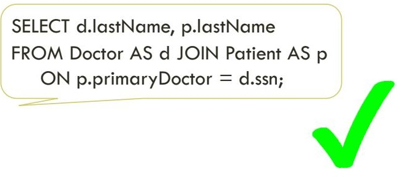
> An equivalent query is the one presented here in which we are using the ON clause. Check that both queries are equivalent but this one helps us understanding the behavior of the query: if we include the join condition in the WHERE clause, it would be mixed with other filtering conditions so, please, use only this type of joins.

## Cartesian product and filter

> As a result, a join is composed of a Cartesian product and a filter as you can see in the example.

## "Self" joins
```sql
    SELECT DISTINCT sr.lastName
    FROM Doctor AS sr JOIN SupervisedBy
                       ON sr.ssn = supervisor
          JOIN Doctor AS se
                       ON se.ssn = supervisee
    WHERE se.salary > $100K;
```
> Remember that we saw how to model tree relationships like supervisor-supervisees. This is the way to issue a query over them. In this case, we are interested in last names of doctors that supervise other doctors whose salary is greater than \$100K.

## Data
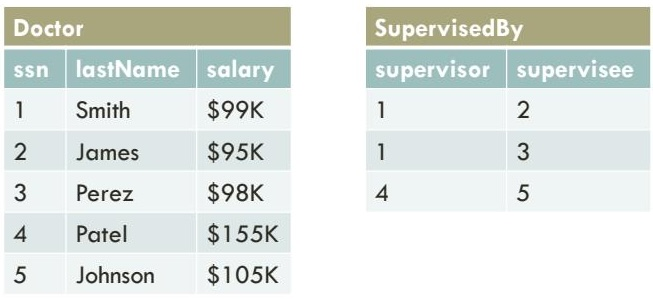
Let's see an example on how the previous query works with the data shown in the slide.
### First join

| "Result"   |             |           |            |     |     |     |     |     |
| ---------- | ----------- | --------- | ---------- | --- | --- | --- | --- | --- |
| supervisor | sr.lastName | sr.salary | supervisee |     |     |     |     |     |
| 1          | Smith       | \$99K     | 2          |     |     |     |     |     |
| 1          | Smith       | \$99K     | 3          |     |     |     |     |     |
| 4          | Patel       | \$155K    | 5          |     |     |     |     |     |
## Second join and filtering
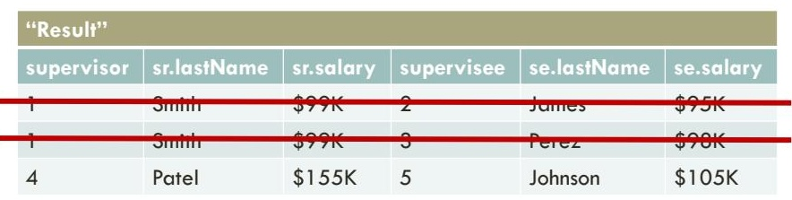

## Interpretation of joins
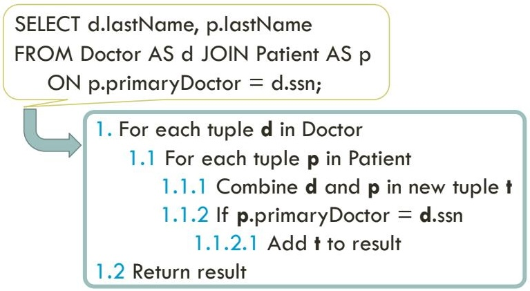
> We can interpret a join as you can see in this slide: we take each tuple in Doctor and each tuple in Patient, we combine the tuples and, if the tuple fulfills the filter, we add it to the final result. Check that this entails performing a Cartesian product between Doctor and Patient, which we have seen it is not efficient.

## Interpretation is not implementation!
Be careful! 
Interpretation is not the same as implementation in SQL. As we have studied, SQL is declarative so we specify what we wish to retrieve but not how. The main goal of SQL query engines is to efficiently implement queries.

## Strategies to implement joins
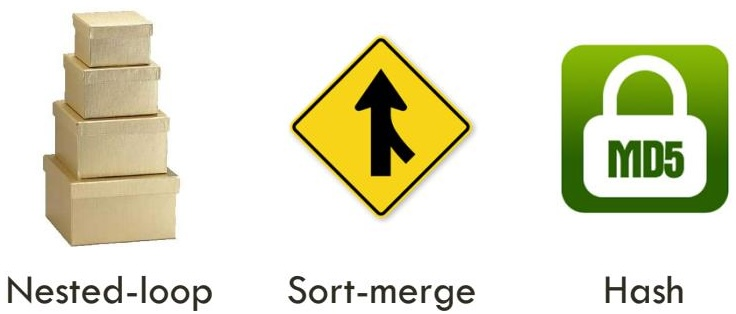
> We can find three different strategies to implement joins: nested-loop, sort-merge and hash.

## Nested-loop, O(n2)
```
1 For each tuple d in Doctor
	1.1 For each tuple p in Patient
	   1.1.1 Combine d and p in new tuple t
	   1.1.2 If p.primaryDoctor = d.ssn
		   1.1.2.1 Add t to result
2 Return result
```

Nested-loop implementation is the traditional implementation in which we have two nested loops and, if the join condition is fulfilled, we add the combination of the tuples to the final result. As a result, we have a complexity of O(n2).

## Sort-merge, O(n log n)
```
 1 Sort both relations Doctor and Patient
 2 While i < Size(Doctor) AND j < Size(Patient)
     2.1 If Patient[j].primaryDoctor != Doctor[i].ssn
        2.1.1 Advance either i or j
     2.2 Else
        2.2.1 Combine Patient[j] and Doctor[i] in t
        2.2.2 Add t to result
        2.2.3 Advance both i and j
 3 Return result
```
> In sort-merge, we sort both relations and iterate both of them at the same time, adding the final combination to the result. As a result, we have a complexity of O(n log n), which is the complexity for sorting the relations, since the rest is performed in O(n).

## Hash, O(n)
```
 1 Hash all values of primaryDoctor for Patient
 2 For each tuple y in Doctor
     2.1 If Hash(y.ssn) is in the hash table of Patient
         2.2.1 Let x be the tuple in the hash table
         2.2.2 Combine x and y in t
         2.2.3 Add t to result
 3 Return result
```
> Finally, the theoretical complexity of the hash implementation is O(n) since we first produce all of the hashes for Patient and, then, for each tuple in the other relation, we find its hash in the lookup table. We finally combine them and add them to the result.

## Set operations

> We are going to study three types of operations: union, intersection and difference. We can perform different types of queries using them but they have also some commonalities.

## Commonalities
![[Pasted image 20260505173603.png]]
> These commonalities are as follows: we perform operations over two relations, they both need to have exactly the same number of attributes and same names for them, and, finally, by default these queries automatically remove duplicates, that is, they have a similar behavior as the DISTINCT clause but we do not need to make it explicit.

## Union
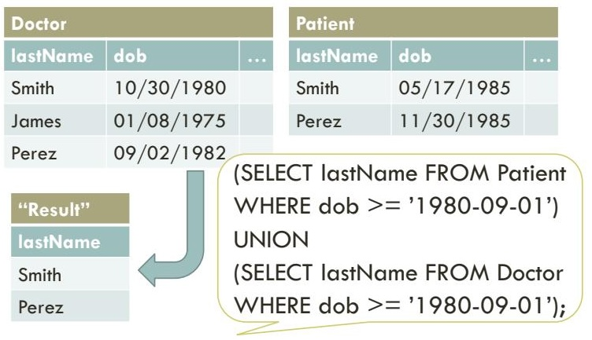
> We retrieve last names of people who were born on or after Sep 1, 1980. Check that both resulting relations before the UNION have the same number of attributes and same names, this is what we need in this type of queries.

## Intersection (not in MySQL)

> Doctors who are also patients. Note that MySQL does not implement INTERSECT.

## Difference (not in MySQL)

> Doctors that are not primary doctors of any patient. Note that the order of the relations is important here. MySQL does not implement EXCEPT.

## Nesting Queries
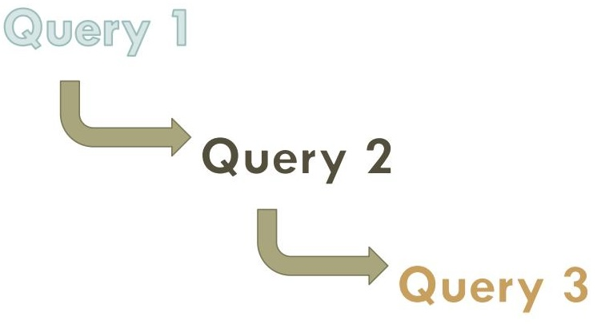
> Do you remember the closure property? It is a property of SQL what we retrieve a relation after performing a query. We can use such feature to perform nested queries as follows.

## Set membership
```sql
SELECT DISTINCT lastName
FROM Doctor AS d JOIN Patient 
 ON d.ssn = primaryDoctor
WHERE d.ssn IN (
	SELECT supervisee
	FROM SupervisedBy JOIN Doctor
	   ON supervisor = ssn
	WHERE salary > $100K);
```
> The IN clause tests for set membership where the set is a collection of values produced by a SELECT subquery. We retrieve the last names of doctors that are primary doctors and their direct supervisors earn more than \$100K.

### Data
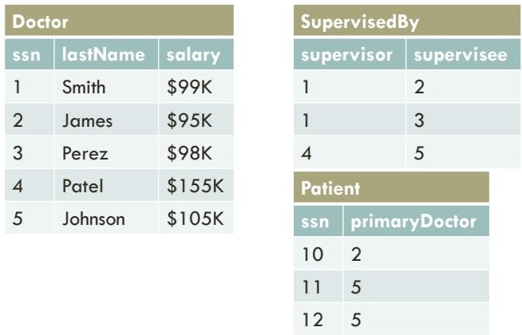
> Let's see an example of the previous query.

### Inner query: join and filtering
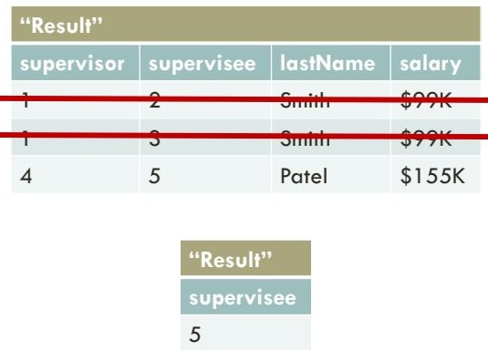

### External query: join and filtering
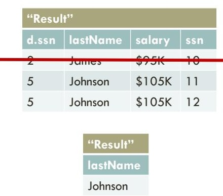

Set comparison (1)
```sql
SELECT ssn FROM Doctor
WHERE salary > SOME (
	SELECT salary
	FROM Doctor JOIN SupervisedBy
		ON ssn = supervisor);
```
> SQL allows us to compare a value over a set. If we wish to express "greater than at least one", we can use > SOME. In this example, we are retrieving doctors whose salary is greater than at least one of the salaries of supervisors. SQL allows <, <=, >, >=, =, and <> with the SOME clause.

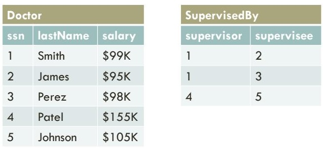
> Let's see an example of the previous query.
### Inner query
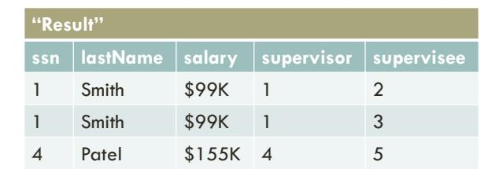
### External query
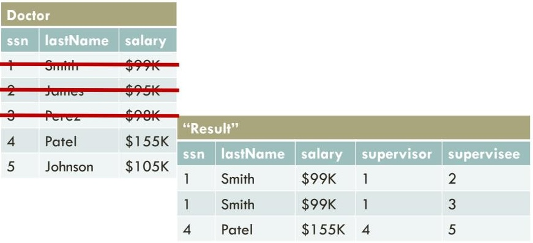
Set comparison (2)
```sql
SELECT ssn FROM Doctor
WHERE salary > ALL (
	SELECT salary
	FROM Doctor JOIN SupervisedBy
	ON ssn = supervisor
);
```
>Similarly, we are able to express "greater than all", so we use the ALL clause to define this condition. In the example, we are retrieving doctors whose salary is greater than all of the salaries of supervisors.

### External query

> Following the previous example…

#### Empty/non-empty sets
```sql
SELECT ssn FROM Doctor AS d
WHERE firstName LIKE 'Reg%' AND EXISTS (
   SELECT COUNT(doctor)
   FROM Visit
   WHERE doctor = d.ssn AND scheduled
      BETWEEN '2015-09-01' AND '2016-08-31'
   HAVING COUNT(doctor) >= 3);
```
> The EXISTS clause tests for empty sets produced by a SELECT subquery. We retrieve doctors whose first names start with "Reg" and they have attended at least three visits between 09-01-2015 and 08-31-2016. Note that we are able to use the tuples of relation Doctor named d in the inner subquery, this is known as correlated subquery. Some scoping rules apply here similar to variables in contemporary programming languages.

## Data
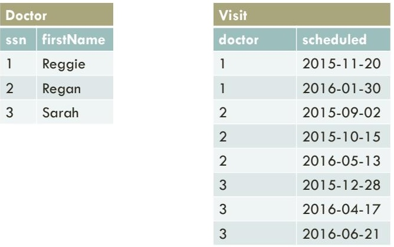
> Let's see an example of the previous query.

### Internal query


## Result

| "Result" |
| -------- |
| ssn      |
| 2        |
# Query execution

Let's study now how the query engine optimizes and executes the queries.

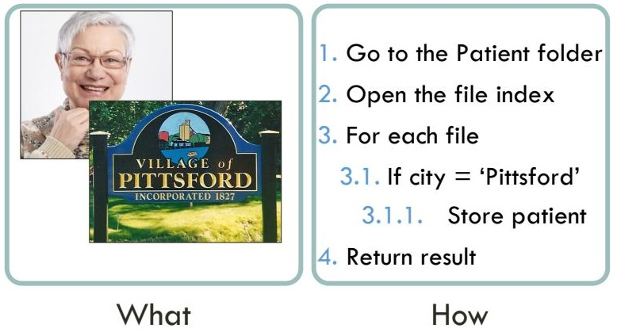
> Remember that one of the properties of SQL is that it is a declarative language, which means that we specify what to retrieve but not how, the query engine is responsible for implementing the how. How is the query engine doing that?

Relational algebra expression
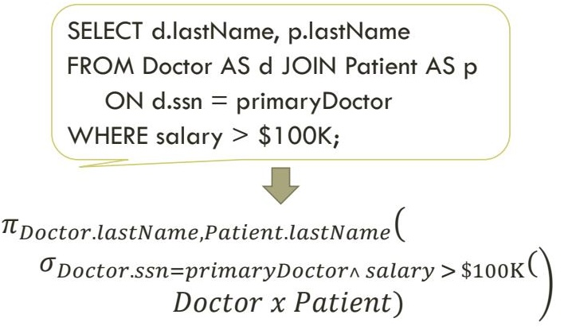
> A query in SQL is automatically translated into a relational algebra expression. Let's study relational algebra.

## Procedural
Relational algebra is a procedural language, which means that a query is executed step by step in the same way as it is expressed.

## Restriction
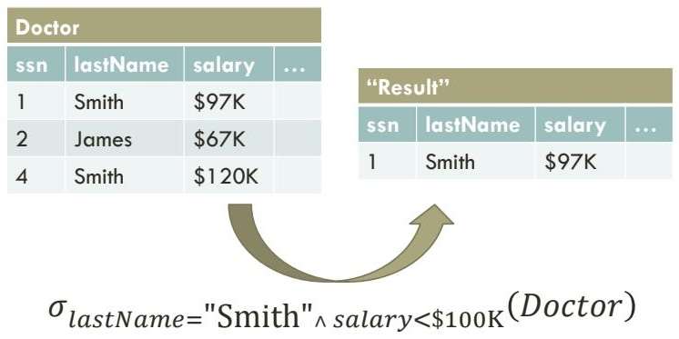
> We use sigma to denote a restriction operation in which we filter the tuples of a relation, in our example, we are retrieving just those doctors whose last name is Smith and has a salary less than \$100K. We may use ˄ (and), ˅ (or) and ¬ (not) for Boolean expressions and =, ≠, <, >, ≤, and ≥ for comparisons.

## Projection
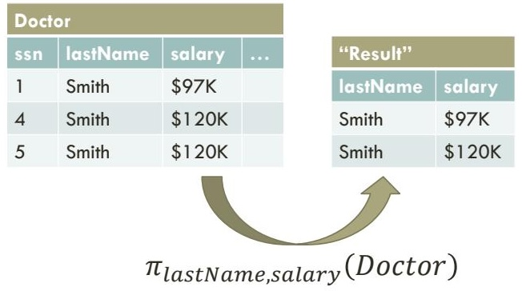
> Projection allows us to retrieve a new relation with just the attributes (columns) specified there. In this example, we are removing all attributes of the Doctor relation except of lastName and salary. The main different with respect to SQL is that, in this case, we remove duplicates since, in the formal language, a relation is a set and, therefore, tuples with the same content can appear only once.

## Composing operations 
$$
\pi_{lastName}(\sigma_{lastName} = \text{"Smith"} \land salary < \$100 \text{K} (Doctor))
$$
We are able to compose operations by nesting them. In this case, we are restricting the Doctor relation and projecting just the last name.

#### Cartesian product

Doctor x Patient

```python
(Doctor.ssn, Doctor.firstName, Doctor.lastName, Doctor.dob, Patient.ssn, Patient.firstName, Patient.lastName, Patient.dob, middleName, salary, primaryDoctor)
```
Cartesian product combines all tuples of two given relations into one single relation. In this case, we are combining Doctor and Patient relations. Check that attributes in the final relation may have exactly the same names, so we concatenate the name of the relation to differentiate among them.

### Joins with Cartesian product
$$
\sigma_{Doctor.ssn=primaryDoctor}(\text{Patient} * \text{Doctor} )
$$
We can combine Cartesian products with a restriction to obtain a join.
### Other (basic) operations
- Union ($\cup$)
- Difference (-)
- Rename ($\rho$): $\rho_{x(A_{1},A_{2},\dots,A_{n})}(E)$
> Relational algebra allows three more basic operations: set union, set difference, and renaming.

## Mandatory for query optimization!
> Relational algebra is the language that allows us optimize our queries in a relational database, let's see how it works.

## Equivalent expressions
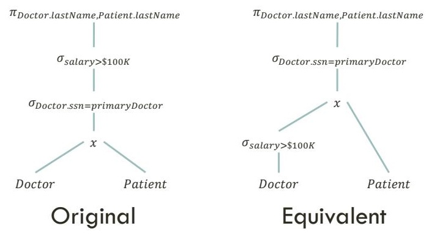
> The same relational algebra expression may have multiple equivalent expressions and not all of them have the same performance. In the next step, the query engine is responsible for evaluating all of these alternatives and selecting the one that is going to perform better. This is done by estimating the costs of the operations. In this example, check that the original expression is computing the whole Cartesian product between Doctor and Patient, however, we are only interested in doctors whose salary is greater than \$100K, therefore, we are able to filter out doctors that are not of our interest. As a result, we predict that the right expression is going to perform better than the original one and we select it to be executed.

## Execution plan
Once the query engine has chosen a relational algebra expression, it is translated into an execution plan over the physical model.

## Operations over the physical model
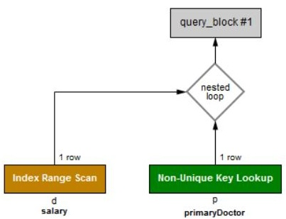
> MySQL allows us to visualize the plan. Check that, in this case, it is using an index over salary to retrieve only those doctors whose salary is greater than \$100K. Then, it is using a nested loop that is using a primary key lookup over patients. As you can see, the execution plan contains the indexes that it is going to use and the algorithms to access the structures.

# Programmatic access
Let's study now how to perform queries programmatically.

## JDBC
Remember that we already saw how to have programmatic access to MySQL using JDBC. We are going to study now transactions and how to prevent SQL injections.

Preventing SQL injection
```java
 "SELECT * FROM users " + 
    "WHERE name ='" + userName + "';"
        userName = "' OR '1'='1"
```
SQL injection is used to attack relational databases. It consists of adding malicious SQL statements to exploit security vulnerabilities. In the example, assume that you have a SQL query coded as you can see at the top that retrieves the info of a specific user, then an attack using the string at the bottom will allow the attacker access to the info of any user in the database.

Use a PreparedStatement!
```java
"SELECT * FROM users " + 
  "WHERE name = ?;"
…
ps.setString(username);
…
```

To prevent SQL injections you need to use the PreparedStatement Java class that takes a SQL query with some input parameters specified by question marks. Then, we can set the parameters of some specific types, which will prevent those injections.

# Malicious people out there!
Please, make sure that you always use PreparedStatement, see in this case that somebody was trying to remove the complete database of the DMV injecting SQL using the license plate.


https://www.bleepingcomputer.com/news/security/researchers-find-sql-injection-tobypass-airport-tsa-security-checks/

# Conclusions
Let's study now how the query engine optimizes and executes the queries.

## SQL
We have studied how to retrieve data from a relational database using SQL. We have studied different constructs that help us in this process, such as joins, aggregations, or set operations. We have also explained a bit of SQL programming.

## Relational algebra
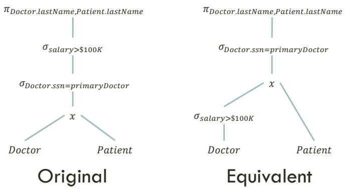
We have also studied relational algebra and executions plans.

## Privacy and ethics
- It is not ethic (and illegal!) to make choices based on race, gender, religion, or origin
- Careful with unintended consequences
- Retrieve people with last name Rivera (these are likely to come from Latin America and be Catholic)
- Aggregating/omitting information does not necessarily preserve privacy
- A large percentage of people in the US can be identified by using ZIP code, birth date, and gender
- In a professional environment, how to behave when facing these issues?
