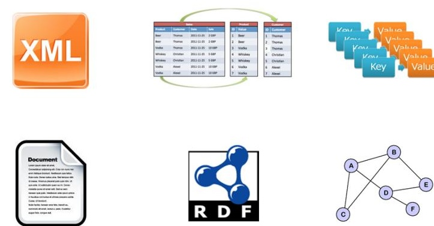
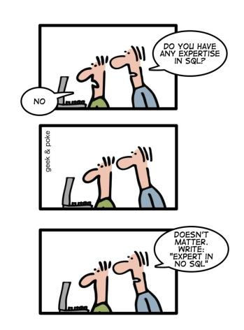
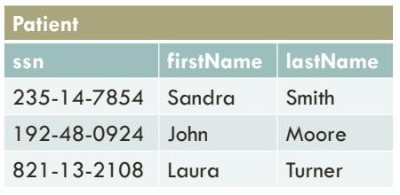
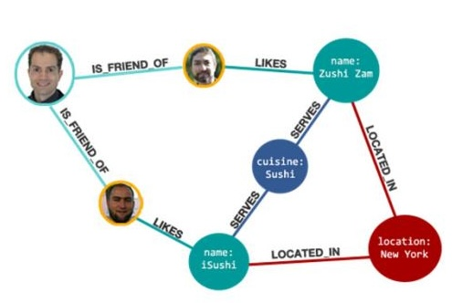

# Document-oriented databases
## Types of NoSQL databases

6 types:
1. XML
2. Column
3. Key-value
4. document
5. RDF
6. Graph
> There are six types of NoSQL databases that we are going to study: XML, column, key-value, document, RDF and graph. There are different classifications for them according to the data they store or their functionality, for instance, XML and document databases are considered specific cases of key-value databases, or RDF databases are considered graph databases. Since these classifications are not uniform and not well-established, we will study each type by itself and you can think on different ways of classifying them.

## Drawbacks of relational databases

- relational databases need to perform several joins
- joins are costly
- new media types as content
	- web pages, videos, audios, etc.
- NoSQL aims to solve one or both of these drawbacks
> Remember that we studied some of the main drawbacks of relational databases: we need to perform several joins to retrieve data of interest, which is usually a costly operation, and there are some new applications that need to manage different types of media content, such as web pages, videos, audios, etc. NoSQL databases aim to solve one or both of these drawbacks by proposing different types of data models.

## Other so-claimed drawbacks

> Other so-claimed drawbacks that NoSQL databases aim to solve with respect to relational databases are their lack of flexibility and scalability. Lack of flexibility entails that we need to have some fixed relations with some fixed attributes in a relational database, that is, the data needs to have a logical model. There are some data applications that demand more flexible models. Lack of scalability entails that a single relational database is not scalable and clusters are not easy to configure and maintain.

### Writing a CV: leverage the NoSQL boom


## Column-oriented DB

> It is a relational database in which the main focus is the columns and not the rows.

### Why we need column-oriented

> The way relational databases stores the data in the hard disk is as follows: every value in a row is stored consecutively. Assume that we have a SQL query like the one in the slide, we will be retrieving first and last names of patients when we are not interested in those. The idea behind these databases is to store A D G, then B E H, and C F I.

## Document-oriented DB

> A document-oriented database allows us to store any object related to a key, which must be unique, so these databases implement a map data structure. In this example, we use the SSNs of patients to store and retrieve them. Some of these databases do not care about the contents of the value. Others, like document-oriented databases, use some metadata about the document to improve the query capabilities of the database. In our example, the metadata is the first and last names of each patient.

### Why We Need Document-oriented DB

> We can have many different types of data and we are not able to use a uniform way to store them, for instance, we can have documents, videos, web pages and relational data for the same application.
## Graph-oriented DB

> These databases allow us to represent data as graphs, in which we have nodes and edges connecting those nodes. In this example, we are modeling some friends of a person who like sushi restaurants located in NY.
### Why we need graph-oriented

> In this type of databases, we are usually interested in paths or more complex queries that involve visiting several, unbounded nodes. In relational, we need to solve these queries by performing a large amount of joins, which we already studied that they are costly. The other problem is that SQL queries need to be bounded, that is, we cannot specify paths of unknown length. As a result, these queries need to be implemented as programs when dealing with relational databases, which is not an easy task.
# Introduction

## Databases, Collections, Documents

> MongoDB organizes the data into databases, each of which contains collections of documents.

## Creating and using a database
```json
use hospMng
```
> The 'use' command will allow us to use an existing database or creating one if it was not there before.
#### Creating a collection
```js
db.createCollection("bills", [
{option1 : value1, option2 : value2, …}])
```
- capped: a fixed-sized collection that automatically overwrites its oldest entries when it reaches its maximum size.
- size: specify a maximum size in bytes for a capped collection.
> MongoDB internally uses a "db" object to send commands to the current database. We use createCollection to create a new collection of documents with some options that are not mandatory. Since MongoDB heavily relies on JSON, the options are specified in JSON. Sample options are capped or size.

Besides these slides, a very good source of information is MongoDB's user manual.

# Documents

## JSON
MongoDB is based on JSON (JavaScript Object Notation), a lightweight data-interchange format.

Sample document:
```json
 { "firstName": "John",
  "lastName": "Smith",
  "dob": new ISODate("1995-10-23"),
  "address": {
   "street": "21 2nd St",
   "city": "New York",
   "state": "NY",
   "postalCode": "10021-3100" },
   "phoneNumbers": [
	   { "type": "home", "number": "212 555-1234"},
	   { "type": "office", "number": "646 555-4567" }
   ]}
```
> JSON data consists of name/value pairs, each of which contains a field name (in double quotes), a colon, and a value, e.g., "firstName": "John". Each pair is separated by commas. Allowed types for values are: string, number, JSON object, array, Boolean, and null. A JSON object is another set of name/value pairs, e.g., address in the example. You can use the ISODate constructor to build dates from strings. Arrays are defined by brackets and they can contain the same types as values in pairs. In the example, an array contains the phone numbers of a patient.

## BSON types

> MongoDB stores documents using BSON, a binary representation of JSON. BSON supports more data types than JSON.

| Туре                    | Number | Alias                 | Notes               |
| ----------------------- | ------ | --------------------- | ------------------- |
| Regular Expression      | 11     | "regex"               |                     |
| DBPointer               | 12     | "dbPointer"           | Deprecated.         |
| JavaScript              | 13     | "javascript"          |                     |
| Symbol                  | 14     | "symbol"              | Deprecated.         |
| JavaScript (with scope) | 15     | "javascriptWithScope" |                     |
| 32-bit integer          | 16     | "int"                 |                     |
| Timestamp               | 17     | "timestamp"           |                     |
| 64-bit integer          | 18     | "long"                |                     |
| Decimal 128             | 19     | "decimal"             | New in version 3.4. |
| Min key                 | -1     | "minKey"              |                     |
| Max key                 | 127    | "maxKey"              |                     |

Inserting a document
```js
db.bills.insert(
  { _id : ObjectId("5099803df3f4948bd2f98391"),
   "address" : { "zipcode" : "14534",
              "city" : "Pittsford",
              "state" : "NY" },
   "amount" : 756.98,
   "patient" : "376-97-9845",
   "id" : 883,
   "bDate" : new ISODate("2010-10-01") })
```
> We insert documents using "insert" over the current collection. To create dates, we need to use the Date function. The field name \_id is reserved for use as a primary key; its value must be unique in the collection, is immutable, and may be of any type other than an array. If an inserted document omits the \_id field, the MongoDB driver automatically generates an ObjectId for the \_id field. By default, MongoDB creates a unique index on the \_id field during the creation of a collection. BSON documents may have more than one field with the same name, however, many MongoDB drivers represent documents using certain structures that do not support duplicate field names.

## Inserting a different document

> In this example, we are inserting a different document in the collection of bills. It is different in the sense that it has a different structure, a different schema, a different logical model. Check that we have not used any specific logical model, we just inserted documents!

## However, in practice…
![[Pasted image 20260505162802.png]]
> While that flexibility can be achieved, in practice, queries refer to the logical model of the documents so, as a result, we should always use documents with similar logical models under the same collection to be efficient.

## In fact…
```js
db.createCollection( "contacts",
	{ validator: { $or:
		[
			{ phone: { $type: "string" } }, 
			{ email: { $regex: /@mongodb\ .com$/ } }, 
			{ status: { $in: [ "Unknown", "Incomplete" ] } }
		]
	}
})
```
> Since version 3.2, MongoDB allows the usage of document validators, which are specified at the collection level, i.e., one validator per collection. A validator is a special type of document that specifies validation rules. Validation occurs during updates and inserts but MongoDB allows some fine-tuning on when and how apply it.

# Basic querying
## Retrieving data
```js
db.bills.find( { "patient": "376-97-9845" } )
db.bills.find( { "address.zipcode": "14534" } )
db.bills.find( { "amount": { $gt: 750 } } )
db. bills.find( {"amount": { $gt: 750 }, 
"address.zipcode": "14534" } )
db. bills.find({ $or: [ {"amount": { $gt: 750 } }, 
{"address.zipcode": "14534" } ] } )
```
> We perform a call to "find" to retrieve data specifying filter conditions in JSON. In these examples, we are retrieving the bills of patient 376-97-9845, bills in zip code 14534, bills whose amount is greater than \$750, bills whose amount is greater than \$750 and in zip code 14534, bills whose amount is greater than \$750 or in zip code 14534.
>
> In the second query, we are referring to a field inside a nested document. MongoDB uses a "dot notation" to specify this type of access. Note also how we specify greater than and how to perform AND and OR operations.

## Query operators
For comparison of different BSON type values, see specified BSON comparison order.

| query | descriptions                                                                                            |
| ----- | ------------------------------------------------------------------------------------------------------- |
| $eq   | Matches values that are equal to a specified value.                                                     |
| $gt   | Matches values that are greater than a specified value.                                                 |
| Sgte  | Matches values that are greater than or equal to a specified value.                                     |
| $in   | Matches any of the values specified in an array.                                                        |
| $lt   | Matches values that are less than a specified value.                                                    |
| $lte  | Matches values that are less than or equal to a specified value.                                        |
| $ne   | Matches all values that are not equal to a specified value.                                             |
| $nin  | Matches none of the values specified in an array.                                                       |
| $and  | Joins query clauses with a logical AND returns all documents that match the conditions of both clauses. |
| $not  | Inverts the effect of a query expression and returns documents that do not match the query expression.  |
| $nor  | Joins query clauses with a logical NOR returns all documents that fail to match both clauses.           |
| $or   | Joins query clauses with a logical OR returns all documents that match the conditions of either clause. |
> MongoDB allows several comparison operators like \$eq, \$gt, \$gte, etc. The \$in and \$nin operators check whether or not the value of a given attribute in a document is contained in an array of values. MongoDB also allows us to define logical operations as well.
### Element

| Name    | Description                                            |
| ------- | ------------------------------------------------------ |
| $exists | Matches document that have the specific field.         |
| $type   | Selects documents if a field is of the specified type. |
### Evaluation

| Query      | Description                                                                                        |
| ---------- | -------------------------------------------------------------------------------------------------- |
| $mod       | Performs a modulo operation on the value of a field and selects documents with a specified result. |
| $regex<br> | Selects documents where values match a specified regular expression.                               |
| $text<br>  | Performs text search.                                                                              |
| $where     | Matches documents that satisfy a JavaScript expression.<br>                                        |

Additional operators allow to require documents that contain or not a specific field, or dealing with arrays and bits. We will study these operations later on.

### Array
| Query         | Description                                                                                     |
| ------------- | ----------------------------------------------------------------------------------------------- |
| $bitsAllClear | Matches numeric or binary values in which a set of bit positions all have a value of 0.         |
| $bitsAllSet   | Matches numeric or binary values in which a set of bit positions all have a value of 1.         |
| $bitsAnyClear | Matches numeric or binary values in which any bit from a set of bit positions has a value of 0. |
| $bitsAnySet   | Matches numeric or binary values in which any bit from a set of bit positions has a value of 1. |
### Bitwise
| Query         | Description                                                                                     |
| ------------- | ----------------------------------------------------------------------------------------------- |
| $bitsAllClear | Matches numeric or binary values in which a set of bit positions all have a value of 0.         |
| $bitsAllSet   | Matches numeric or binary values in which a set of bit positions all have a value of 1.         |
| $bitsAnyClear | Matches numeric or binary values in which any bit from a set of bit positions has a value of 0. |
| $bitsAnySet   | Matches numeric or binary values in which any bit from a set of bit positions has a value of 1. |

## Projection
```js
db.bills.find( { "patient": "376-97-9845" },
        { "patient" : 1,
         "id" : 1 } )
```

Special rule: A projection cannot contain both include and exclude specifications!

We can also project the fields of a document specifying whether or not we want to retrieve them. We can provide an optional list of fields to the find method indicating our preferences. 1 or true indicates that we wish to retrieve that field from the documents, and 0 or false that we do not wish to retrieve it. The special rule comes from the fact that, when indicating zero, MongoDB will keep all fields except those with zeros; when indicating one, MongoDB will exclude all fields except those with ones.

Sorting
```js
db.bills.find().sort( 
    { "patient" : 1, "address.zipcode": -1 } )
```
> It is also possible to retrieve documents and sort them. We use 1 for ascending and -1 for descending.

Updating documents
```js
db.bills.update(
   { "patient" : "376-97-9845" },
   { $set: { "address.zipcode" : "14467", 
           "address.city" : "Henrietta" } } )
```
>It is possible to update the data in the documents. We use a filtering condition first and, then, the set of changes we want to perform.
## Removing documents

```js
db.bills.remove(
     { "patient" : "376-97-9845" } )
```
> It is also possible to remove documents.
# Advanced querying

## Exists

```json
{field: {$exists: <boolean>}}
```
When \<boolean> is true, \$exists matches the documents that contain the field, including documents where the field value is null. If \<boolean> is false, the query returns only the documents that do not contain the field. Note that this is not possible in SQL: every tuple contains a value for each attribute and, if the value is unknown, then we use null. In MongoDB, we can "skip" such field.

## Array containment
```json
 { <array_field> : <value> }
```
To check if an array field contains a certain value, you must use the syntax above.

## Aggregation pipeline
```js
db.collection.aggregate( [ <stage1>, <stage2>, ... ] )
```
> To perform aggregations, MongoDB allows us to specify an array of stages that are processed sequentially. Each stage describes a data processing step. Documents enter a multi-stage pipeline that transforms the documents into aggregated results. Pipeline stages do not need to produce one output document for every input document; e.g., some stages may generate new documents or filter out documents. Pipeline stages can appear multiple times in the pipeline.

## Projection operation
- `<field>: <1 or true>, <field>:<0 or false>`
 - Inclusion/exclusion of a field
- `_id: <0 or false>`
 - Suppression of the \_id field
- `<field>: <expression>`
	 - Add a new field or reset the value of an existing field.
- If you specify the exclusion of a field other than _id, you cannot employ any other $project specification forms.
> The \$project takes a document that can specify the inclusion of fields, the suppression of the \_id field, the addition of new fields, and the resetting of the values of existing fields. Alternatively, you may specify the *exclusion* of fields.

## Example

```js
db.bills.aggregate( [
     { $project : { "address.zipcode" : 1,
                   "amount" : 1,
                   "patient" : 1 } } ] )
```
returns
```json
{ 
	_id : "5099803df3f4948bd2f98391",
	"address" : { "zipcode" : "14534" },
	"amount" : 756.98,
	"patient" : "376-97-9845" 
}
```

Another example
```js
db.bills.aggregate( [
     { $project : { "address.zipcode" : 1,
                  "amount" : 1,
                  "patient" : 1,
                  _id : 0 } } ] )
                                    
```
>Documents with no \_ids!

The aggregation pipeline allows you to store documents with no ids!

## Match operation
```json
{$match: {<query>}}
```
>It filters the documents to pass only the documents that match the specified condition(s) to the next pipeline stage. You can use any of the query expressions we saw before.
### Example

```js
db.bills.aggregate( [ 
     { $match : { "address.zipcode" : "14534" } } ] )
```

## Group operation
```json
{$group: {_id: <expression>, <field>: { <accumulator1> : <expression1>}, ... }}
```

The \_id field is mandatory; however, you can specify an \_id value of null to calculate accumulated values for all the input documents as a whole. The remaining computed fields are optional and computed using the \<accumulator\> operators.

### Example

>In this case, we are aggregating the order collection. We are applying two different stages: match and group. In the first stage, we are filtering documents whose status is equal to A. Then, we are grouping those orders whose cust\_id is the same and adding their amounts. Note that, to achieve the final results, we are overriding the \_id field to indicate that they are the same documents.

## Accumulators
![[Pasted image 20260505164927.png]]
![[Pasted image 20260505165022.png]]
These are all the accumulators that MongoDB supports.

 ### Grouping by null
```js
db.bills.aggregate(
	[ $group : {
        _id : null,
        avgAmount : { $avg: "$amount" } ] )
```
> If we group using \_id : null, we are not performing any grouping, so we will perform a global computation. For instance, we are computing here the average amount of all existing bills.

### Grouping by date
```js
db.bills.aggregate( 
  [ { $match : {"patient" : "376-97-9845"} },
   { $group : {
       _id : { month : { $month: "$bDate" }, 
                year : { $year: "$bDate" } },
       avgAmount : { $avg: "$amount" },
       count : { $sum: 1 } } } ] )
```
> This aggregation is retrieving bills of patient 376-97-9845 and grouping them by month and year, in which we are computing the average amount and counting. Note that we refer to existing fields in expressions, e.g., "\$bDate" that stores the billing date of a bill. Note also that, different than SQL, we are able to perform multiple aggregations at the same time in MongoDB.

Sample output
- Bills of patient 376-97-9845:
- $357.5, 10/15/2015
- $789.2, 10/28/2015
- $471.8, 11/22/2015
- Result:
```json
  { _id : { month:10, 
             year:2015},
      avgAmount : $573.35,
      count : 2 }
```
```json
{ _id : {   month:11, 
			year:2015},
 avgAmount : $471.8,
 count : 1 }
```
> This is the output we will get from the previous query.

## Lookup operation
![[Pasted image 20260505165315.png]]
The \$lookup stage does an equality match between a field from the input documents with a field from the documents of the "joined" collection. To each input document, the \$lookup stage adds a new array field whose elements are the matching documents from the "joined" collection. The \$lookup stage passes these reshaped documents to the next stage.

## Lookup fields
![[Pasted image 20260505165340.png]]
> This is the description of the fields to perform lookup.

#### Example

```js
db.bills.aggregate( 
  [ $lookup : { from : patients, localField : "patient", 
      foreignField : "_id", as : "new_patients" } ] )
```

```json
{ …
   patient : 376-97-9845,
   … }
```
will then be used to convert to 
```
{ …
  patient : 376-97-9845,
  new_patients : [
	  { firstName : … }
  ]
  … 
}
```
> This is a sample output of the previous query. Assuming a bill belonging to patient 376-97- 9845, the \$lookup operation will fetch such patient in the patients collection and include it in an array field called patients. Note that we could add multiple objects to this array, however, in this case, only one patient is added.

### Another example
```js
db.patients.insert(
  { _id : "376-97-9845",
   "firstName" : "Jennifer",
   "visits" : [758, 345],
   … } )
```

```js
db.visits.insert(
  { _id : 345,
   "doctor" : "893-12-8934",
   "otherNotes" : "fever",
   … } )
db.visits.insert(
  { _id : 758,
   "doctor" : "9094-56-9292",
   "otherNotes" : "neck",
   … } )
```

### Another example (II)
```js
db.patients.aggregate( 
  [ { $lookup : { from : visits, localField : "visits", 
               foreignField : "_id", as : "visitsInfo" } } ] )
```

### Another example (III)

```
{ _id : "376-97-9845",
   "firstName" : "Jennifer",
   "visits" : [758, 345],
   "visitsInfo" : [
     { _id : 345,
      "doctor" : "893-12-8934",
      "otherNotes" : "fever",
       … },
```

```
{ _id : 758,
    "doctor" : "9094-56-9292",
    "otherNotes" : "neck",
    … }
   ],
… }
```


Deconstructs an array field from the input documents to output a document for *each* element. Each output document is the input document with the value of the array field replaced by the element.


The following example performs \$unwind over the given collection. Note that the aggregation framework allows collections of documents with repeated \_ids.

```
Indexes
```

By default, \_id field is automatically indexed. We can create other indexes as well, in this example, we are indexing the score field in the records collection: a value of 1 specifies an index that orders items in ascending order, while a value of -1 specifies an index that orders items in descending order.

# Installation and programmatic access

#### Java access
```java
MongoClient client = new MongoClient();
MongoDatabase db = client.getDatabase("hospMng");
for (Document d : db.getCollection("bills").find())
      System.out.println(d.getDouble("amount"));
client.close();
```

### Data insertion (1)

```java
Document add = new Document();
add.append("zipcode", "14534");
add.append("city", "Pittsford");
add.append("state", "NY");
Document bill = new Document("address", add);
bill.append("amount", 756.98);
```

#### Data insertion (2)

```java
bill.append("patient", "376-97-9845");
bill.append("id", 883);
bill.append("date", 
     DateFormat.getDateInstance().parse(
            "Dec 15, 2015"));
db.getCollection("bills").insertOne(bill);
```

# Conclusions
- Document-oriented DB
	- flexibility
		- The major benefit of document-oriented databases is the flexibility they provide. The database is just a bucket of data in which you store everything without analyzing its consistency. However, as we discussed, this is not 100% true since, in practice, we usually need to keep the same document structure for all documents in the collection.

In practice, however, the documents in a collection share a similar structure.

## References("normalized")

> There are two ways of dealing with the "logical model" (structure, schema) of the documents. On one hand, references are links that connect documents as in the example. In this case, MongoDB will not help us enforcing them and we need an external program for this. You can think of these documents as "normalized".

## Embedded ("denormalized")
On the other hand, embedded documents capture relationships between data by storing related data in a single document. You can think of these documents as "denormalized".

## Considerations
- Atomicity of write operations.
- Document growth.
- Data use and performance.
- …
> Considerations that we need to think of while modeling MongoDB databases are:

1. Atomicity of write operations: in MongoDB, write operations are atomic at the document level, and no single write operation can atomically affect more than one document or more than one collection. A denormalized data model with embedded data combines all related data for a represented entity in a single document. This facilitates atomic write operations since a single write operation can insert or update the data for an entity. Normalizing the data would split the data across multiple collections and would require multiple write operations that are not atomic collectively. However, schemas that facilitate atomic writes may limit ways that applications can use the data or may limit ways to modify applications. The Atomicity Considerations documentation describes the challenge of designing a schema that balances flexibility and atomicity.
2. Document growth: some updates, such as pushing elements to an array or adding new fields, increase a document's size. For the MMAPv1 storage engine, if the document size exceeds the allocated space for that document, MongoDB relocates the document on disk. When using the MMAPv1 storage engine, growth consideration can affect the decision to normalize or denormalize data.
3. Data use and performance: when designing a data model, consider how applications will use your database. For instance, if your application only uses recently inserted

documents, consider using Capped Collections. Or if your application needs are mainly read operations to a collection, adding indexes to support common queries can improve performance.

## Main drawbacks

> The main drawbacks of these databases is that performing complex queries over them is not an easy task. Furthermore, ensuring consistency between the values is not allowed.

## Fast processing of dynamic objects
Because of the previous drawbacks, document-oriented databases are perfect for fast processing of dynamic objects. For instance, a shopping cart is pretty difficult to maintain in a database, however, we can keep track of it while the user is adding/removing/updating the cart and, at the end, it will be permanently stored in a relational database (if needed). Since these databases scale pretty good, it is also a good solution for big players like Amazon, Walmart or others.

## Non-active security mechanisms

> To give an idea of the great success of MongoDB, some students in Germany recently found around 40K MongoDB databases with non-active security mechanisms, exposing records to everybody, including a large telco company in France. You can find their original report in that URL.
