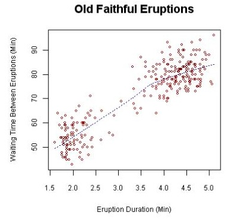

## Data preparation
### Definition
Data preparation consists of transforming data into a suitable format for analysis by cleaning, integrating, transforming and reducing data.

> Fayyad, U., Piatetsky-Shapiro, G., & Smyth, P. (1996). From Data Mining to Knowledge Discovery in Databases. *AI Magazine*, *17*(3), 37.
### Main questions
- What data a certain dataset contains?
- What are its attributes and how they relate?
- Types of attributes:
	- Nominal: name or class of object, e.g., Ford, Buick, …
	- Ordinal: intrinsic order (and transitivity) but do not know the distance between values, e.g., hot/warm/cool/cold.
	- Interval: known ranking order and distance between values, e.g., temperature, calendar time, currency.
	- Ratio: units on the same scale, e.g., elapsed time.

# Descriptive statistics 
## Measures
- Central tendency: They show how aggregated the data points are.
- Variation: They show how spread out the data points are from the mean.
### Arithmetic mean
- Having N data points each of which takes value xi , the mean is computed as follows:

$$\overline{x} = \frac{1}{N} \sum_{i=1}^{N} x_i$$

A.k.a. average. This is natively implemented in SQL and MongoDB.
### Geometric mean
- Same notation as before:
$$\begin{aligned} \left(\prod_{i=1}^n x_i\right)^{\frac{1}{n}} &= \sqrt[n]{x_1x_2\cdots x_n} \ &\exp\left(\frac{\sum_{i=1}^n \ln a_i}{n}\right) \end{aligned}$$

### Mode
- Having N data points each of which takes value yi , the mode is the most frequent value.
- There can be multiple modes.
you must start from the histogram, which we will discuss below.
The mode is the value that occurs most often in a set of data points. To compute the mode,

### Median
- Having N data points each of which takes value yi , the median is computed as follows:
$$\widetilde{y} = y_{(N+1)/2}$$
- However, this is problematic when having odd/even numbers.
> The median is the middle value in a group of numbers.
### Quartiles
- First quartile: middle data point between smallest and median.
- Third quartile: middle data point between median and highest.
> The first quartile is defined as the middle number between the smallest number and the median of the data set. The second quartile is the median of the data. The third quartile is the middle value between the median and the highest value of the data set. (From Wikipedia.) There are different methods to compute quartiles using the median and depending on the number of data points that you find in each half.

### Quantiles
- If we have y1, …, yn, the p-th quantile can be computed as:
- k = floor(n \* p/100)
- Any quantile is the average number between position k and position k+1.
## SQL implementation
- Conceptually, we want something like:
```sql
-- Unfortunately, this doesn't work.
SELECT value FROM Relation
ORDER BY value ASC
OFFSET k LIMIT 2
```
### Window functions in SQL (I)
- They compute values over a set of related tuples (the "window") while preserving the original tuples, unlike aggregation which collapses them.
```sql
SELECT value, ROW_NUMBER() OVER ( ORDER BY value) AS position FROM Relation
```
### Window functions in SQL (II)
- It is also possible to compute unrestricted aggregations and still preserve the tuples.
```sql
SELECT value, COUNT(\*) OVER() AS total\_count FROM Relation
```
>This will add a total\_count to each tuple that corresponds to the size of the relation.
### Window functions in MongoDB (I)
```js
db.Collection.aggregate([
      {$setWindowFields:
             {sortBy: { value: 1 },
             output: {
                    position:
                          {$documentNumber: {}}}
      }])
```
### Window functions in MongoDB (II)
- Using {$count: {}} counts the number of documents and adds
the count field to every other document.

- No sortBy field is equivalent to OVER() in SQL:
```json
{$setWindowFields:
        output: {
                 cnt_field:{$count: {}},
                 min_field:{$min: {"$value"}},
                 avg_field:{$avg: {"$value"}}, …
        }
}
```
### Variance and standard deviation
- Having N data points each of which takes value xi , the variance is computed as follows:
$$\mathrm{Var}(X) = \frac{1}{n} \sum_{i=1}^n (x_i - \mu)^2$$
$$Var(X) = \frac{\sum x^2}{n} - \mu^2$$

> Variance is the expectation of the squared deviation of a random variable from its mean. Informally, it measures how far a set of (random) numbers are spread out from their average value. (From Wikipedia.) The standard deviation is a measure that is used to quantify the amount of variation or dispersion of a set of data values. (From Wikipedia.) Same as before, MongoDB has issues processing this one. It is natively implemented in MySQL and MongoDB, but MongoDB has issues with decimal processing.

# Charts
## Histogram

> A histogram is a representation of the distribution of numerical data. In SQL and MongoDB, this is just a GROUP BY clause to count occurrences. When computing mode, you must choose the one with the largest frequency.

## Scatter plot

> A scatter plot represents the relationship between two variables. From Wikipedia: Waiting time between eruptions and the duration of the eruption for the Old Faithful Geyser in Yellowstone National Park, Wyoming, USA. This chart suggests there are generally two types of eruptions: short-wait-short-duration, and long-wait-long-duration.

## Time series

> A time series is similar to a scatter plot but the X-axis is related to time. (From https://www.statisticshowto.datasciencecentral.com/timeplot/.)

## Box and whisker

> A box and whisker plot—also called a box plot—displays the five-number summary of a set of data. The five-number summary is the minimum, first quartile, median, third quartile, and maximum. (From https://www.khanacademy.org/math/statisticsprobability/summarizing-quantitative-data/box-whisker-plots/a/box-plot-review.)
# Scaling

## Feature scaling

| Name               | Formula                                                  |
| ------------------ | -------------------------------------------------------- |
| Min-max            | $x' = \frac{x - \min(x)}{\max(x) - \min(x)}$             |
| Mean               | $x' = \frac{x - \mathrm{average}(x)}{\max(x) - \min(x)}$ |
| Z-score (standard) | $z = \frac{x - \mu}{\sigma}$                             |
| Z-score (squared)  | $z^2 = \frac{(x - \mu)^2}{\mathrm{Var}(X)}$              |
| Robust             | $x' = \frac{x - Q_2(x)}{Q_3(x) - Q_1(x)}$                |
> From Wikipedia.
# Binning

## Equal width
- For a given k, we create k buckets.
- Let's x\_max and x\_min be the max and min values we want to bin.
- We'll compute buckets as follows:
	- width = (x_max - x_min)/k
	- \[x_min, x_min + width)
	- \[x_min + width, x_min + width * 2)
	- ...
	- \[x_min + width * (k-1), x_max + tiny_value)
- The bin id for a value x is FLOOR((x – x\_min)/width).
## Equal depth
- If there are n values, we want to create buckets of size n/k.
- If a value is in position p, its bin id is CEIL(p \* k/n).
# Fixing data issues (integration)

## Codes
- (CSCI-)320, 420, 620, …
- 14534, 14623, …
> There are attributes for which it does not make sense to compute certain descriptive statistics like codes: it does not make sense to compute the mean of a set of zip codes.
## Unusual values
- When we analyze using descriptive statistics, some of these values are unusual.
- They cannot be automatically discarded, you need to analyze them and decide.
- Examples:
	- Salaries, release dates of movies, bills, etc.
## Missing values
- You can fill in holes using different strategies, e.g., adding the mean/mode of the attribute.
	- This may introduce bias!
- Placeholders for missing values, e.g., death year of an actor is set to 9999 (meaning it is still alive).
- De-referencing: using another source to include the values.
	- The other source may also have issues.
	- How to connect them? Using ids is preferred, beware when using names, titles, etc.
# Conclusions
## Data preparation
We have analyzed how to prepare data.
## Legal, privacy and ethics
- Data fixes may introduce biases (especially when searching for patterns)
- Several missing values replaced by certain numbers can deviate the descriptive statistics of an attribute
