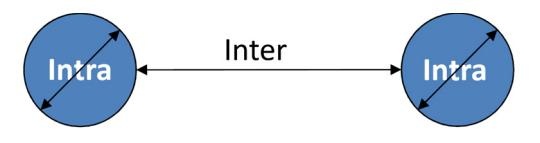
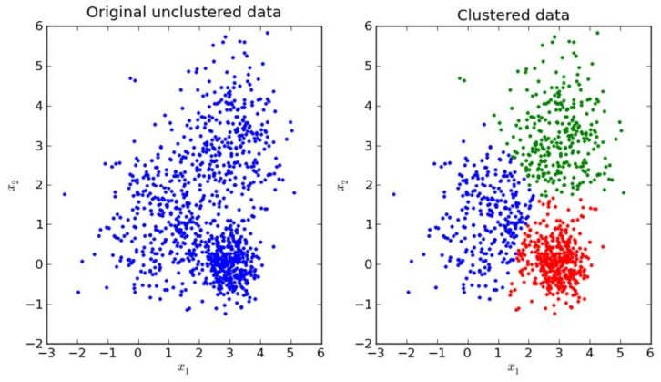

# Clustering 
These slides correspond to the unit of clustering.
## Definition

Cluster analysis or clustering is the task of grouping a set of objects such that objects in the same group (cluster) are more similar (in some sense) to each other than to those in other groups (clusters). - Wikipedia

Definition of the problem.

This is the roadmap we will follow.

## What is a cluster?

- "(…) The notion of cluster cannot be precisely defined. Clustering is in the eye of the beholder, and as such, researchers have proposed many induction principles and models whose corresponding optimization problem can only be approximately solved by an even larger number of algorithms."
- Vladimir Estivill-Castro: Why so many clustering algorithms: a position paper. SIGKDD Explorations 4(1): 65-75 (2002).

There is no definition of what a cluster is.

## Cluster models
- Connectivity models based of connectivity distance
- Centroid models based on central individuals and the distance to other individuals
- Density models based on connected and dense regions in a space
- Graph-based models based on cliques and their relaxations

Some examples of cluster models are those above.

# The K-Means Algorithm

A good source of info
http://stanford.edu/~cpiech/cs221/hando uts/kmeans.html
Besides these slides, a very good source of information is Piech's handout.

## Basic idea

- We are going to work with points in a given space ℝ<sup>n</sup>
- Given a k (the number of clusters to be generated), we store k centroids that will define the central points of the cluster
- We assign points to clusters
- We reassess centroids based on current assignment
The basic idea…

## Basic Idea in Action

Figure (a) represents the original points and (c) the clustering after random assignment and how we progress.

## Formal statement

- A set of points  $x^{(1)}$ , ...,  $x^{(m)}$
- Each  $\mathbf{x}^{(i)} \in \mathbb{R}^n$
- $^{\bullet}$  Our goal: compute  $\mu_{1}\text{, }...\text{, }\mu_{k}$  centroids and a label  $c^{(i)}$  for each point
- $^{\bullet} \text{ Each } \mu_i {\in } \ \mathbb{R}^n$
- $\|x^{(i)} - \mu_i\|$  is the Euclidean distance between the points, i.e., Sqrt(( $x^{(i)}[0]$ - $\mu_i[0]$ )^2 + ( $x^{(i)}[1]$ - $\mu_i[1]$ )^2) + ...)
- Any distance can be used

Definitions needed.

## Algorithm 

1.  Initialize cluster centroids $\mu_1, \mu_2, \dots, \mu_k \in \mathbb{R}^n$ randomly. 
2. Repeat until convergence: { 
	For every i, set $c^{(i)} := \arg\min_{j} ||x^{(i)} - \mu_j||^2.$ 
	For each j, set $\mu_j := \frac{\sum_{i=1}^m 1\{c^{(i)} = j\}x^{(i)}}{\sum_{i=1}^m 1\{c^{(i)} = j\}}.$ 
}

The k-means algorithm.

## Pseudo-code in Python-like (I)

```python
# Function: K Means
#------
# K-Means is an algorithm that takes in a dataset and a constant
# k and returns k centroids (which define clusters of data in the
# dataset which are similar to one another).
def kmeans (dataset, k):
	# Initialize centroids randomly
	numFeatures = dataset.getNumFeatures ()
	centroids= getRandomCentroidsnumFeatures,)
	# Initialize book keeping vars.
	iterations = 0
	oldcentroids = None
	# Run the main k-means algorithm
	while not shouldstop(oldCentroids, centroids, iterations) :
		# Save old centroids for convergence test. Book keeping.
		oldentroids = centroids
		iterations += 1
		# Assign labels to each datapoint based on centroids
		labels =getlabelsdataset, centroids)
		# Assign centroids based on datapoint labels
		centroids = getCentroids(dataset, labels, k)
		# We can get the labels too by calling getLabels(dataset, centroids)
		return centroids
```

## Pseudo-code in Python-like (II)
```python
# Function: Should Stop
# -----------------
# Returns True or False if k-means is done. K-means terminates either
# because it has run a maximum number of iterations OR the centroids
# stop changing.
def shouldStop(oldCentroids, centroids, iterations):
	if iterations › MAX ITERATIONS: return True 
	return oldcentroids == centroids

# Function: Get Labels
# ---------
# Returns a label for each piece of data in the dataset.
def getLabels(dataset, centroids):
	# For each element in the dataset, chose the closest centroid.
	# Make that centroid the element's label.

# Function: Get Centroids
# -------------
# Returns k random centroids, each of dimension n.
def getCentroids(dataset, labels, k):
	# Each centroid is the geometric mean of the points that
	# have that centroid's label. Important: If a centroid is empty (no points hav
	# that centroid's label) you should randomly re-initialize it.
```

## Example (I)


## Example (II)
- Points: (1, 2), (1, 3), (2, 3), (2, 4), (4, 6), (5, 6), (6, 6), (6, 8), (7, 7)
- Manhattan distance: d((a, b), (x, y)) = |a x| + |b – y|
- k=2
- We are going to limit to x(i) ℕ<sup>2</sup>
- Random centroids: $\mu_{1}$ = (2, 8), $\mu_{2}$ = (8, 1)

## Example (III)

- Distances ($\mu_{1}$ | $\mu_{2}$):

|     | 1      | 2      | 4       | 5      | 6      | 7      |
| --- | ------ | ------ | ------- | ------ | ------ | ------ |
| 2   | 7 \| 8 |        |         |        |        |        |
| 3   | 6 \| 9 | 5 \| 8 |         |        |        |        |
| 4   |        | 4 \| 9 |         |        |        |        |
| 6   |        |        | 4 \| 11 | 5 \| 8 | 6 \| 7 |        |
| 7   |        |        |         |        |        | 6 \| 7 |
| 8   |        |        |         |        | 4 \| 9 |        |
- Recomputing centroids: $\mu_{1}$ = (34/9, 45/9) = (4, 5), $\mu_{2}$ = (2, 2) (randomly reinitialized since no points were assigned to 2)

## Example (IV)


## Example (V)

- Centroids: $\mu_{1}$ = (4, 5), $\mu_{2}$ = (2, 2)
- Distances ($\mu_{1}$ | $\mu_{2}$):

|     | 1      | 2      | 4      | 5      | 6       | 7       |
| --- | ------ | ------ | ------ | ------ | ------- | ------- |
| 2   | 6 \| 1 |        |        |        |         |         |
| 3   | 5 \| 2 | 4 \| 1 |        |        |         |         |
| 4   |        | 3 \| 2 |        |        |         |         |
| 6   |        |        | 1 \| 6 | 2 \| 5 | 3 \| 8  |         |
| 7   |        |        |        |        |         | 5 \| 10 |
| 8   |        |        |        |        | 5 \| 10 |         |
- Recomputing centroids: $\mu_{1}$ = (28/5, 33/5) = (6, 7), $\mu_{2}$ = (6/4, 12/4) = (1, 3)

## Example (VI)


## Example (VII)

- Centroids: $\mu_{1}$ = (6, 7), $\mu_{2}$ = (1, 3)
- Distances ($\mu_{1}$ | $\mu_{2}$):

|     | 1       | 2      | 4      | 5      | 6       | 7       |
| --- | ------- | ------ | ------ | ------ | ------- | ------- |
| 2   | 10 \| 1 |        |        |        |         |         |
| 3   | 8 \| 0  | 8 \| 1 |        |        |         |         |
| 4   |         | 8 \| 2 |        |        |         |         |
| 6   |         |        | 3 \| 6 | 2 \| 7 | 1 \| 8  |         |
| 7   |         |        |        |        |         | 1 \| 10 |
| 8   |         |        |        |        | 1 \| 10 |         |
- Recomputing centroids: $\mu_{1}$ = (28/5, 33/5) = (6, 7), $\mu_{2}$ = (6/4, 12/4) = (1, 3); same centroids so stop

## Example (VIII)


# Evaluating Clusters
Sum of squared errors

$$SSE = \sum_{i=1}^{k} \sum_{x_j \in C_i} (x_j - \mu_i)^2$$

This is used as a method of measuring the variation within clusters.

## Example

° Centroids:  $\mu_1=(6,7), \ \mu_2=(1,3). \ \{(1,2), (1,3), (2,3), (2,4)\}$  are assigned to  $\mu_2$ , and  $\{(4,6), (5,6), (6,6), (6,8), (7,7)\}$  are assigned to  $\mu_1$ 

|   | 1 | 2 | 4 | 5 | 6 | 7 |
|---|---|---|---|---|---|---|
| 2 | 1 |   |   |   |   |   |
| 3 | 0 | 1 |   |   |   |   |
| 4 |   | 2 |   |   |   |   |
| 6 |   |   | 3 | 2 | 1 |   |
| 7 |   |   |   |   |   | 1 |
| 8 |   |   |   |   | 1 |   |

• SSE =  $1^2 + 0^2 + 1^2 + 2^2 + 3^2 + 2^2 + 1^2 + 1^2 + 1^2 = 22$ 

## Finding a good k

Note that in k-means we need to provide a k (the number of clusters); however, it is unclear how many clusters we should have for a given set of points. We need to find what it is called the "knee": the region where the change is slope begins to level off.

## Intra- and inter-cluster distances

- There are two criteria to assess cluster quality:
	- Intercluster dissimilarity
	- Intracluster similarity
- Ideally, the distance between clusters should be large, while the distance within clusters should be very small



## Silhouette coefficient
- For each x(i), a(x(i)) is the average distance between x(i) and all the points classified in cluster c(i) (same cluster as x(i))
- For each x(i) and cluster c(k) (other than c(i)), let d(x(i), c(k)) the average distance between x(i) and all the points classified in c(k)
- Let b(x(i)) = d(x(i), c(k)) such that it is minimum
- $S(x^{i}))$ = b(x(i)) a($x^{i}$)/max{a($x^{i}$), b($x^{i}$)}
- S $\in$ \[-1, 1] = ∑ S($x^{i}$/m (recall that we have m points)
- The closer S = 1 the better

## Example

-  C1: (1, 2), (1, 3); C2: (3, 4), (4, 5); C3: (7, 7), (8, 7)
-  S((1, 2)) = 5 - 1 / 5; S((1, 3)) = 4 - 1 / 4
- $S((3, 4)) = 3.5 - 2 / 3.5$;  $S((4, 5)) = 5.5 - 2 / 5.5$ 
- $S((7,7)) = 6 - 1 / 6$$;  $S((8,7)) = 7 - 1 / 7$ 
- $S = (4/5 + 3/4 + 1.5/3.5 + 3.5/5.5 + 5/6 + 6/7)/6$
	 $= (0.8 + 0.75 + 0.43 + 0.64 + 0.83 + 0.86)/6 = 0.72$

## Mutual information (I)

- Let  $X = \{x^{(1)}, ..., x^{(m)}\}$  be a set of elements (points in our case)
- $^{\circ}$  Let U = {U\_1, ..., U\_R} and V = {V\_1, ..., V\_C} be two partitions, where U\_i (i=1..R) and V\_k (k=1..C) are clusters of elements
- These partitions are also called assignments, e.g.,  $x^{(1)}\in U_1,\, x^{(2)}\in U_1,\, x^{(3)}\in U_2$  ...
Adapted from: https://en.wikipedia.org/wiki/Adjusted\_mutual\_information

## Mutual information (II)
- Each partition is pairwise disjoint, i.e., a given elements cannot belong to two or more clusters at the same time
- More formally, $U_{i}\ \cap\ U_{k} = \emptyset$ and $V_{i}\ \cap\ V_{k} = \emptyset$
- Each partition is complete, i.e., all elements are found in U and V
- More formally, $U_{1}\ \cap\ U_{2} \cdots \cap\ U_{R} = X$ and $V_{1}\ \cap\ V_{2} \cdots \cap\ V_{C} = X$

## Mutual information (III)
- The probability of an element assigned to a cluster  $U_i$  (similarly  $V_i$ ) is:
	- $P_{U}(i) = \mid U_{i} \mid / m$  (similarly  $P_{V}(k) = \mid V_{k} \mid / m)$
- The entropy associated with a partition is:
	- H(U) =  $\sum_{i=1}^{R}$  P<sub>U</sub>(i) log P<sub>U</sub>(i) (similarly H(V) =  $\sum_{k=1}^{C}$  P<sub>V</sub>(k) log P<sub>V</sub>(k))
- The mutual information between U and V is as follows:
	- MI(U, V) =  $\sum_{i=1}^{R} \ \sum_{k=1}^{C} \ \mathrm{P_{UV}(i,\,k)} \log \ (\mathrm{P_{UV}(i,\,k)/(P_{U}(i)} \ \mathrm{P_{V}(k)))}$
	- where  $P_{UV}(i,\,k)=\,|\,U_{i}\cap V_{k}^{}\,|\,/m$
- Special case:
	- If p (any probability) = 0, then, we assume p log p = 0
- MI(U, V) is non-negative and upper bounded by H(U) and H(V)

## Example (I)
- Assume the following partitions (assignments):
- U={U1 = {x(1), x(3), x(7)}, U2 = {x(4), x(5)}, U3 = {x(2), x(6), x(8)}}
- $V = \{ V_1 = \{x^{(3)}, x^{(4)}, x^{(7)}\}, V_2 = \{x^{(2)}, x^{(5)}\}, V_3 = \{x^{(1)}\}, V_4 = \{x^{(6)}, x^{(8)}\}\}$
- Pu(1)=3/8, Pu(2) = 2/8, Pu(3) = 3/8
- Pv(1)=3/8, Pv(2)=2/8, Pv(3)=1/8, Pv(4)=2/8
- H(U) = -(3/8 log 3/8 + 2/8 log 2/8 + 3/8 log 3/8) = 1.08
- H(V) = -(3/8 log 3/8 + 2/8 log 2/8 + 1/8 log 1/8 + 2/8 log 2/8) = 1.32

## Example (II)
- Puv:

|    | V1  | V2  | V3  | V4  |
|----|-----|-----|-----|-----|
| U1 | 2/8 | 0/8 | 1/8 | 0/8 |
| U2 | 1/8 | 1/8 | 0/8 | 0/8 |
| U3 | 0/8 | 1/8 | 0/8 | 2/8 |
- MI(U, V) = 2/8 log 2/8/(3/8 \* 3/8) + 0 + 1/8 log 1/8/(3/8 \* 1/8) + 0 + 1/8 log 1/8/(2/8 \* 3/8) + 1/8 log 1/8/(2/8 \* 2/8) + 0 + 0 + 0 + 1/8 log 1/8/(3/8 \* 1/8) + 0 + 2/8 log 2/8/(3/8 \* 2/8) = 0.76

## Example (III)

- Assume the following partitions (assignments):
- U={U1 = {x(1), x(3), x(7)}, U2 = {x(4), x(5)}, U3 = {x(2), x(6), x(8)}} • Y={Y1 = {x(1)}, Y2 = {x(2)}, Y3 = {x(3), x(4)}, Y4 = {x(5), x(6)}, Y5 = {x(7)}, Y6 = {x(8)}}
- Pu(1)=3/8, Pu(2) = 2/8, Pu(3) = 3/8
- Py(1)=1/8, Py(2)=1/8, Py(3)=2/8, Py(4)=2/8, Py(5)=1/8, Py(6)=1/8
- H(U) = -(3/8 log 3/8 + 2/8 log 2/8 + 3/8 log 3/8) = 1.08
- H(Y) = -(1/8 log 1/8 + 1/8 log 1/8 + 2/8 log 2/8 + 2/8 log 2/8 + 1/8 log 1/8 + 1/8 log 1/8) = 1.73

## Example (IV)

• Puy:

|    | Y1  | Y2  | Y3  | Y4  | Y5  | Y6  |
|----|-----|-----|-----|-----|-----|-----|
| U1 | 1/8 | 0/8 | 1/8 | 0/8 | 1/8 | 0/8 |
| U2 | 0/8 | 0/8 | 1/8 | 1/8 | 0/8 | 0/8 |
| U3 | 0/8 | 1/8 | 0/8 | 1/8 | 0/8 | 1/8 |

• MI(U, Y) = 1/8 log 1/8/(3/8\*1/8) + 0 + 1/8 log 1/8/(3/8\*2/8) + 0 + 1/8 log 1/8/(3/8\*1/8) + 0 + 0 + 0 + 1/8 log 1/8/(2/8\*2/8) + 1/8 log 1/8/(2/8\*2/8) + 0 + 0 + 0 + 1/8 log 1/8/(3/8\*1/8) + 0 + 1/8 log 1/8/(3/8\*2/8) + 0 + 1/8 log 1/8/(3/8\*1/8) = 0.74

## Distance based on MI

- Having partitions U, V and Y, we cannot compare their mutual information directly but using a metric
- H(U) = 1.08, H(V) = 1.32, H(Y) = 1.73, MI(U, V) = 0.76, MI(U, Y) = 0.74
- Distance: D(U, V) = 1 (MI(U, V) / Max(H(U), H(V)))
- D(U, V) = 0.42, D(U, Y) = 0.57
- U and V are closer than U and Y

Adapted from: https://en.wikipedia.org/wiki/Mutual\_information#Metric. The mutual information of U with respect to V and Y seem very similar. However, they are not if we consider the following distance.

## Adjustment for chance (I)

| $U\backslash V$ | $V_1$           | $V_2$    |     | $V_C$    | Sums                   |
|-----------------|-----------------|----------|-----|----------|------------------------|
| $U_1$           | n <sub>11</sub> | $n_{12}$ |     | $n_{1C}$ | $a_1$                  |
| $U_2$           | $n_{21}$        | $n_{22}$ |     | $n_{2C}$ | $a_2$                  |
| :               | :               | :        | ٠., | :        |                        |
| $U_R$           | $n_{R1}$        | $n_{R2}$ |     | $n_{RC}$ | $a_R$                  |
| Sums            | $b_1$           | $b_2$    |     | $b_C$    | $\sum_{ij} n_{ij} = N$ |
From Vinh, Nguyen Xuan; Epps, Julien; Bailey, James (2010), "Information Theoretic Measures for Clusterings Comparison: Variants, Properties, Normalization and Correction for Chance" (PDF), The Journal of Machine Learning Research, 11 (oct): 2837–54

## Adjustment for chance (II)

$$\mathbf{E}\{I(\mathbf{U},\mathbf{V})\} = \sum_{i=1}^{R} \sum_{j=1}^{C} \sum_{n_{ij}=\max(a_i+b_j-N,0)}^{\min(a_i,b_j)} \frac{n_{ij}}{N} \log(\frac{N.n_{ij}}{a_ib_j}) \frac{a_i!b_j!(N-a_i)!(N-b_j)!}{N!n_{ij}!(a_i-n_{ij})!(b_j-n_{ij})!(N-a_i-b_j+n_{ij})!}$$

$$AMI(\mathbf{U}, \mathbf{V}) = \frac{I(\mathbf{U}, \mathbf{V}) - \mathbf{E}\{I(\mathbf{U}, \mathbf{V})\}}{\max\{H(\mathbf{U}), H(\mathbf{V})\} - \mathbf{E}\{I(\mathbf{U}, \mathbf{V})\}}$$

From Vinh, Nguyen Xuan; Epps, Julien; Bailey, James (2010), "Information Theoretic Measures for Clusterings Comparison: Variants, Properties, Normalization and Correction for Chance" (PDF), The Journal of Machine Learning Research, 11 (oct): 2837–54.
"To correct the measures for randomness it is necessary to specify a model according to which random partitions are generated. Such a common model is the "permutation model" (Lancaster, 1969, p. 214), in which clusterings are generated randomly subject to having a fixed number of clusters and points in each clusters."

# Hierarchy of clusters
- There are two choices: agglomerative and divisive.
- In agglomerative, each point forms its own cluster and they get aggregated.
- In divisive, all points form a single cluster and they get split.
- The key is the linkage method: having two clusters A and B with points assigned to each of them, decide d(A, B), the distance between A and B.
Check: https://en.wikipedia.org/wiki/Hierarchical\_clustering

## Linkage methods (excerpt)

| Names                                                                   | Formula                                                                                                                                                                                                                                                                            |
| ----------------------------------------------------------------------- | ---------------------------------------------------------------------------------------------------------------------------------------------------------------------------------------------------------------------------------------------------------------------------------- |
| Maximum or complete-linkage<br>clustering                               | $\max_{a \in A, b \in B} d(a,b)$                                                                                                                                                                                                                                                   |
| Minimum or single-linkage<br>clustering                                 | $\min_{a\in A,b\in B}d(a,b)$                                                                                                                                                                                                                                                       |
| Unweighted average linkage clustering (or UPGMA)                        | $\frac{1}{ A \cdot B }\sum_{a\in A}\sum_{b\in B}d(a,b).$                                                                                                                                                                                                                           |
| Weighted average linkage clustering (or WPGMA)                          | $d(i \cup j,k) = \frac{d(i,k) + d(j,k)}{2}.$                                                                                                                                                                                                                                       |
| Centroid linkage clustering, or<br>UPGMC                                | $\| \mu_A - \mu_B\ \|^2$ where $\mu_A$ and $\mu_B$ are the centroids of A resp. B.                                                                                                                                                                                                 |
| Median linkage clustering, or<br>WPGMC                                  | $d(i \cup j, k) = d(m_{i \cup j}, m_k)$ where $m_{i \cup j} = \frac{1}{2} \left(m_i + m_j\right)$                                                                                                                                                                                  |
| Versatile linkage clustering <sup>[9]</sup>                             | $\sqrt[p]{\frac{1}{ A \cdot B }\sum_{a\in A}\sum_{b\in B}d(a,b)^p}, p\neq 0$                                                                                                                                                                                                       |
| Ward linkage, [10] Minimum<br>Increase of Sum of Squares<br>(MISSQ)[11] | $\frac{ \|A\|  \cdot  \|B\| }{ \|A \cup B\| } \| \mu_A - \mu_B\ \|^2 = \sum_{x \in A \cup B} \| x - \mu_{A \cup B}\|^2 - \sum_{x \in A} \|x - \mu_A\|^2 - \sum_{x \in B} \|x- \mu_B\|^2$                                                                                           |
| Minimum Error Sum of<br>Squares (MNSSQ) <sup>[11]</sup>                 | $\sum_{x \in A \cup B} \lVert x - \mu_{A \cup B} \rVert^2$                                                                                                                                                                                                                         |
| Minimum Increase in Variance<br>(MIVAR) <sup>[11]</sup>                 | $\begin{split} &\frac{1}{ A \cup B } \sum_{x \in A \cup B} \| x - \mu_{A \cup B}\|^2 - \frac{1}{ A } \sum_{x \in A} \ x - \mu_A\|^2 - \frac{1}{ B } \sum_{x \in B} \ x - \mu_B\|^2 \\ &= \operatorname{Var}(A \cup B) - \operatorname{Var}(A) - \operatorname{Var}(B) \end{split}$ |

## Example (I)

- Cluster A: p1=(1, 2), p2=(2, 3)
- Cluster B: p3=(8, 7), p4=(7, 8), p5=(9, 9)
- Cluster C: p6=(4, 1), p7=(5, 2), p8=(6, 1)
- Minimum Linkage (Single Linkage): Smallest distance between any two points.
- Maximum Linkage (Complete Linkage): Largest distance between any two points.
- Average Linkage: Mean of all pairwise distances.

## Example (II)

```
• A and B:
 • p1-p3: |1-8| + |2-7| = 12
 • p1-p4: |1-7| + |2-8| = 12
 • p1-p5: |1-9| + |2-9| = 15
 • p2-p3: |2-8| + |3-7| = 10
```

- p2-p4: |2-7| + |3-8| = 10
- p2-p5: |2-9| + |3-9| = 13
- Min: 10
- Max: 15
- Mean: (12 + 12 + 15 + 10 + 10 + 13)/6 = 72/6 = 12

## Example (III)

```
• A and C:
 • p1-p6: |1-4| + |2-1| = 4
 • p1-p7: |1-5| + |2-2| = 4
 • p1-p8: |1-6| + |2-1| = 6
 • p1-p6: |2-4| + |3-1| = 4
```

- p1-p7: |2-5| + |3-2| = 4
- p1-p8: |2-6| + |3-1| = 6
- Min: 4
- Max: 6
- Mean: (4 + 4 + 6 + 4 + 4 + 6)/6 = 28/6 = 4.67

## Example (IV)

```
• B and C:
 • p3-p6: |8-4| + |7-1| = 10
 • p3-p7: |8-5| + |7-2| = 8
 • p3-p8: |8-6| + |7-1| = 8
 • p4-p6: |7-4| + |8-1| = 10
 • p4-p7: |7-5| + |8-2| = 8
 • p4-p8: |7-6| + |8-1| = 8
 • p5-p6: |9-4| + |9-1| = 13
 • p5-p7: |9-5| + |9-2| = 11
 • p5-p8: |9-6| + |9-1| = 11
• Min: 8
• Max: 13
• Mean: (10 + 8 + 8 + 10 + 8 + 8 + 13 + 11 + 11)/9 = 87/9 = 9.67
```

# Conclusions

We have studied a technique to cluster points together.
## Fairness in clustering
- Group fairness for sensitive attributes (gender, ethnicity, religion…)
- Choosing a cluster with a high gender or ethnic skew for positive or negative actions, e.g., interview shortlisting or high scrutiny
- Could also lead to reinforcement of societal stereotypes: more black people go to jail
From Savitha Sam Abraham, Deepak P, Sowmya S. Sundaram: Fairness in Clustering with Multiple Sensitive Attributes. EDBT 2020: 287-298.